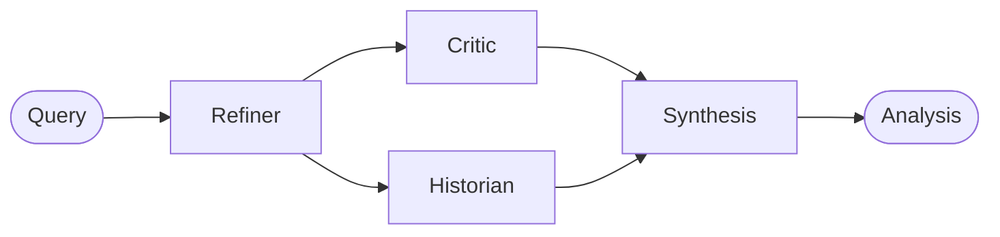

# CogniVault

[](https://github.com/aucontraire/cognivault/actions/workflows/docs.yml)


[](LICENSE)

**Multi-agent workflow orchestration for LLMs.** CogniVault runs your question through a four-agent analysis pipeline — refine, critique, contextualize, synthesize — on a LangGraph DAG with parallel execution, structured Pydantic outputs, full event observability, and an optional FastAPI/WebSocket service layer.

📖 **[Documentation →](https://aucontraire.github.io/cognivault/)** (Material for MkDocs, organized by [Diátaxis](https://diataxis.fr))

## How it works



- **Refiner** sharpens the raw query into an answerable question.
- **Critic** stress-tests it: assumptions, logical gaps, biases (in parallel).
- **Historian** retrieves relevant context via hybrid search — local markdown notes plus PostgreSQL full-text (in parallel).
- **Synthesis** integrates all perspectives into a final structured analysis.

Each agent returns a typed Pydantic model (validated against OpenAI structured-output strict mode), and every step emits correlated events for tracing and diagnostics.

## Features

- **LangGraph DAG orchestration** — StateGraph execution with parallel branches, retries, timeouts, and graceful degradation
- **Structured outputs end-to-end** — schema-validated agent responses (GPT-5-compatible), persisted as queryable JSONB when the database is enabled
- **Adaptive agent selection** — a resource optimizer can trim the pipeline per query based on complexity and historical performance
- **Declarative workflows** — optional YAML-defined DAGs with decision/aggregator/validator/terminator nodes and prompt composition, no code changes required
- **Hybrid retrieval** — the Historian combines file-based and PostgreSQL full-text search with configurable ratios, deduplication, and fallbacks
- **Event-driven observability** — correlation-tracked events across the whole run, health checks, and CLI diagnostics
- **API service layer** — FastAPI endpoints with WebSocket streaming of live workflow progress
- **Markdown/wiki export** — analyses export with frontmatter metadata for personal knowledge bases

## Requirements

- Python 3.12
- [Poetry](https://python-poetry.org/docs/#installation)
- An OpenAI API key
- Optional: Docker (for the PostgreSQL 17 + pgvector development database)

## Quickstart

```bash
git clone https://github.com/aucontraire/cognivault.git
cd cognivault

# Install dependencies and git hooks
make install

# Configure your API key
echo "OPENAI_API_KEY=sk-..." > .env

# Ask your first question
make run QUESTION="What are the trade-offs of event-driven architecture?"
```

Or use the CLI directly:

```bash
poetry run cognivault --help
```

### Optional: database & API service

```bash
make db-setup                 # Start PostgreSQL 17 + pgvector via Docker and run migrations
make db-status                # Verify connectivity
bash scripts/start_api.sh     # Launch the FastAPI service (WebSocket streaming included)
```

## Configuration

Key environment variables (see the [configuration guide](https://aucontraire.github.io/cognivault/getting-started/configuration/) for the full list):

| Variable | Purpose |
|---|---|
| `OPENAI_API_KEY` | LLM access (required) |
| `HISTORIAN_HYBRID_SEARCH_ENABLED` | Toggle file + database hybrid retrieval |
| `HISTORIAN_HYBRID_SEARCH_FILE_RATIO` | Blend ratio between file and database results |

Agent behavior can also be customized declaratively through YAML workflow definitions — see [example workflows](src/cognivault/workflows/examples/).

## Documentation

The [docs site](https://aucontraire.github.io/cognivault/) follows the Diátaxis framework:

| Section | For |
|---|---|
| [Tutorials](https://aucontraire.github.io/cognivault/getting-started/quickstart/) | Getting up and running |
| [How-to Guides](https://aucontraire.github.io/cognivault/user-guide/cli-usage/) | CLI, API, export, and database tasks |
| [Reference](https://aucontraire.github.io/cognivault/api/) | API reference (mkdocstrings) and agent specs |
| [Explanation](https://aucontraire.github.io/cognivault/architecture/overview/) | Architecture, ADRs, and design rationale |

## Development

```bash
make test              # Full test suite (4,400+ tests: unit, integration, contract, performance)
make check             # Format (black) + type-check (mypy)
make coverage          # Coverage report
make typecheck-strict  # Strict mypy
```

The project uses contract tests against external APIs, OpenAI schema-compatibility validation as a pre-commit hook, and CI regression tests for LLM parameter handling. See the [development guide](https://aucontraire.github.io/cognivault/development/) and [CONTRIBUTING.md](CONTRIBUTING.md).

## Project status

The core platform — 4-agent pipeline, LangGraph orchestration, structured outputs, event system, API layer, hybrid search — is implemented and heavily tested. Longer-horizon capabilities (semantic/embedding-based retrieval, knowledge-graph features) are design-stage: the database schema is in place, but the retrieval and knowledge-evolution layers are not yet built. Docs pages describing unimplemented designs carry explicit status banners so the documentation always distinguishes shipped behavior from design intent.

## License

[AGPL-3.0](LICENSE)
