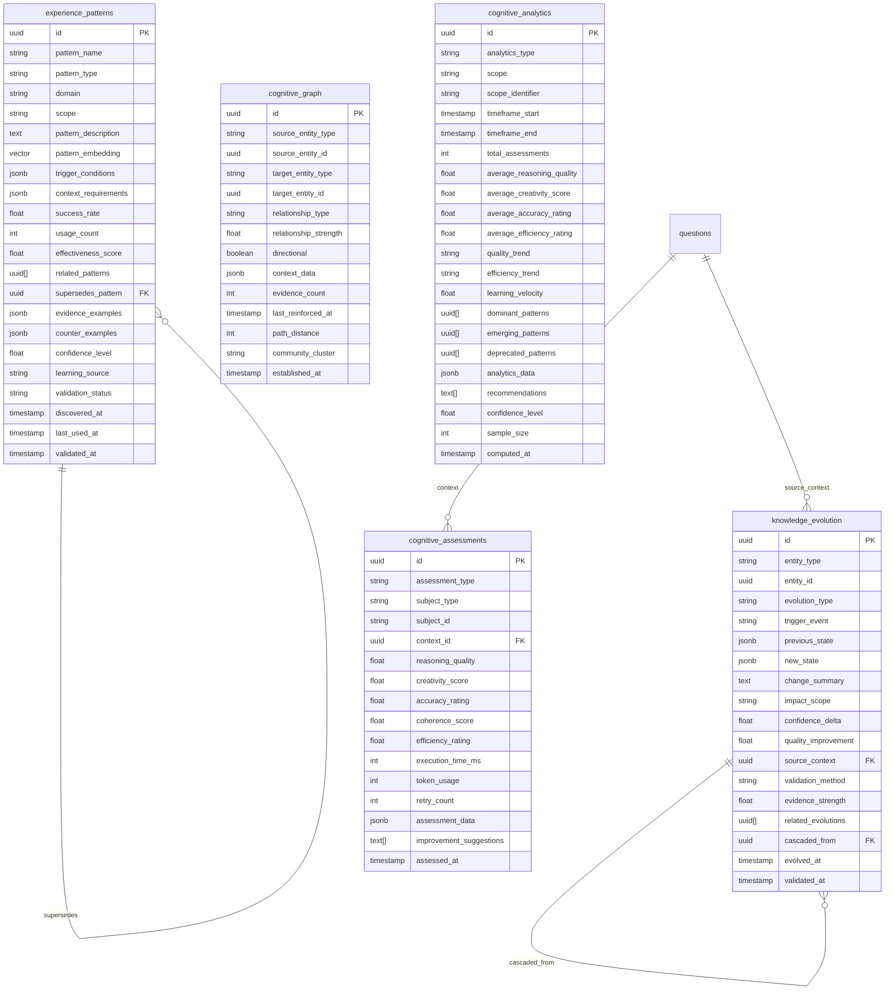

# Cognitive Database Layer

**Advanced Intelligence Storage and Analytics for CogniVault**

The Cognitive Database Layer provides sophisticated cognitive data storage, semantic intelligence, and analytics capabilities built on PostgreSQL 17 with pgvector integration. This system enables experience-based learning, knowledge evolution tracking, and comprehensive intelligence monitoring.

## Overview

The Cognitive Database Layer implements five core cognitive intelligence tables:

- **Cognitive Assessments**: Track agent performance and intelligence patterns
- **Experience Patterns**: Store learned behavioral patterns for future application
- **Knowledge Evolution**: Monitor how understanding and insights develop over time
- **Cognitive Graph**: Manage semantic relationships between cognitive entities
- **Cognitive Analytics**: Provide performance tracking and trend analysis

## Architecture

### Database Schema



### Repository Pattern

Each cognitive table has a dedicated repository class extending `BaseRepository`:

- `CognitiveAssessmentRepository`: Performance tracking and assessment analytics
- `ExperiencePatternRepository`: Pattern discovery, similarity matching, effectiveness tracking
- `KnowledgeEvolutionRepository`: Evolution tracking, impact analysis, learning velocity
- `CognitiveGraphRepository`: Graph traversal, relationship management, community detection
- `CognitiveAnalyticsRepository`: Analytics computation, trend analysis, dashboard generation

### Service Layer

The `CognitiveService` class provides high-level business logic:

```python
from cognivault.services import CognitiveService

service = CognitiveService()

# Create cognitive assessment
assessment = await service.create_agent_assessment(
    agent_name="refiner_agent",
    reasoning_quality=0.85,
    creativity_score=0.72,
    accuracy_rating=0.91,
    execution_time_ms=2500,
    improvement_suggestions=["Consider more diverse examples"]
)

# Learn success pattern
pattern = await service.learn_success_pattern(
    pattern_name="Context-Aware Search Pattern",
    domain="search",
    scope="agent",
    pattern_description="Request clarification for ambiguous queries",
    trigger_conditions={"query_ambiguity": "> 0.7"},
    evidence_examples=[{"query": "bank", "improvement": 0.4}]
)

# Record knowledge evolution
evolution = await service.record_knowledge_evolution(
    entity_type="topic",
    entity_id=topic_id,
    evolution_type="refinement",
    trigger_event="User feedback on explanation quality",
    new_state={"confidence": 0.95, "clarity_score": 0.88},
    change_summary="Improved definition clarity"
)

# Generate intelligence report
report = await service.generate_system_intelligence_report(
    scope="system",
    days_back=30
)
```

## Key Features

### 1. Cognitive Assessments

**Track multi-dimensional agent performance:**

- **Reasoning Quality**: Logical consistency and depth (0.0-1.0)
- **Creativity Score**: Novel solution generation capability (0.0-1.0)  
- **Accuracy Rating**: Factual correctness and precision (0.0-1.0)
- **Coherence Score**: Internal consistency of responses (0.0-1.0)
- **Efficiency Rating**: Resource utilization effectiveness (0.0-1.0)

**Performance Analytics:**
```python
# Get performance trends
trends = await repos.cognitive_assessments.get_performance_trends(
    subject_type="agent",
    subject_id="refiner_agent",
    days_back=30
)

# Identify improvement opportunities
opportunities = await repos.cognitive_assessments.get_improvement_opportunities(
    subject_type="agent",
    subject_id="refiner_agent"
)

# Get top performers
performers = await repos.cognitive_assessments.get_top_performers(
    subject_type="agent",
    metric="reasoning_quality",
    limit=10
)
```

### 2. Experience Patterns

**Learn from success and failure patterns:**

- **Success Patterns**: Behaviors that lead to positive outcomes
- **Failure Modes**: Common failure patterns to avoid
- **Adaptation Strategies**: Methods for handling specific situations

**Pattern Discovery and Matching:**
```python
# Find similar patterns using vector similarity
similar_patterns = await repos.experience_patterns.find_similar_patterns(
    query_embedding=pattern_embedding,
    similarity_threshold=0.8,
    domain="reasoning",
    limit=5
)

# Update pattern effectiveness based on usage
updated_pattern = await repos.experience_patterns.update_pattern_effectiveness(
    pattern_id=pattern_id,
    success=True,
    effectiveness_delta=0.1
)

# Get most effective patterns
effective_patterns = await repos.experience_patterns.get_most_effective_patterns(
    domain="search",
    min_usage_count=5,
    limit=10
)
```

### 3. Knowledge Evolution

**Track how knowledge and understanding develops:**

- **Refinement**: Improving existing knowledge accuracy
- **Expansion**: Adding new information or capabilities
- **Contradiction**: Resolving conflicting information
- **Synthesis**: Combining multiple sources into unified understanding

**Evolution Analysis:**
```python
# Get evolution history for an entity
evolutions = await repos.knowledge_evolution.get_evolutions_by_entity(
    entity_type="topic",
    entity_id=topic_id,
    limit=10
)

# Analyze evolution impact
impact_analysis = await repos.knowledge_evolution.get_impact_analysis(
    impact_scope="domain",
    days_back=30
)

# Calculate learning velocity
velocity = await repos.knowledge_evolution.get_learning_velocity(
    entity_type="pattern",
    days_back=30,
    window_size=7
)
```

### 4. Cognitive Graph

**Semantic relationships between cognitive entities:**

- **Relationship Types**: 'enables', 'conflicts_with', 'refines', 'generalizes'
- **Strength Scoring**: Weighted relationships (0.0-1.0)
- **Graph Traversal**: Shortest path, neighbor discovery
- **Community Detection**: Cluster related entities

**Graph Operations:**
```python
# Create semantic relationship
relationship = await repos.cognitive_graph.create_relationship(
    source_entity_type="pattern",
    source_entity_id=pattern_id,
    target_entity_type="assessment",
    target_entity_id=assessment_id,
    relationship_type="enables",
    relationship_strength=0.8
)

# Find shortest path between entities
path = await repos.cognitive_graph.find_shortest_path(
    source_entity_type="pattern",
    source_entity_id=pattern_a_id,
    target_entity_type="pattern", 
    target_entity_id=pattern_b_id,
    max_hops=6
)

# Get entity neighbors
neighbors = await repos.cognitive_graph.get_entity_neighbors(
    entity_type="topic",
    entity_id=topic_id,
    max_distance=2,
    limit=20
)
```

### 5. Cognitive Analytics

**Comprehensive intelligence monitoring:**

- **Performance Summaries**: Aggregated metrics across timeframes
- **Trend Analysis**: Direction and velocity of improvement
- **Pattern Effectiveness**: Which patterns work best where
- **Learning Insights**: System intelligence evolution

**Analytics Operations:**
```python
# Get performance dashboard
dashboard = await repos.cognitive_analytics.get_performance_dashboard(
    scope="agent",
    days_back=30
)

# Analyze trends for specific scope
trends = await repos.cognitive_analytics.get_trend_analysis(
    scope="agent",
    scope_identifier="refiner_agent",
    days_back=30
)

# Get latest analytics
latest = await repos.cognitive_analytics.get_latest_analytics(
    scope="system",
    scope_identifier="production",
    analytics_type="performance_summary",
    limit=5
)
```

## Database Performance Optimization

### Indexes

The cognitive layer includes comprehensive indexing for optimal performance:

**Cognitive Assessments:**
- Composite: `(assessment_type, subject_type, subject_id)`
- Single: `context_id`, `assessed_at`, `reasoning_quality`, `accuracy_rating`
- GIN: `assessment_data` (JSONB queries)

**Experience Patterns:**
- Composite: `(pattern_type, domain)`, `(source_relationship)`
- Single: `scope`, `effectiveness_score`, `success_rate`, `validation_status`
- Vector: `pattern_embedding` (cosine similarity)
- GIN: `trigger_conditions` (JSONB queries)

**Knowledge Evolution:**
- Composite: `(entity_type, entity_id)`, `(evolution_type)`
- Single: `impact_scope`, `source_context`, `evolved_at`, `confidence_delta`
- GIN: `previous_state`, `new_state` (JSONB queries)

**Cognitive Graph:**
- Composite: `(source_entity_type, source_entity_id, relationship_type)`
- Single: `relationship_type`, `relationship_strength`, `community_cluster`
- GIN: `context_data` (JSONB queries)

**Cognitive Analytics:**
- Composite: `(analytics_type, scope, scope_identifier)`
- Single: `timeframe_start`, `timeframe_end`, `computed_at`, `quality_trend`
- GIN: `analytics_data` (JSONB queries)

### Query Performance

**Typical query performance targets:**
- Assessment retrieval: <100ms for recent data
- Pattern similarity search: <200ms with vector indexes
- Graph traversal (6 hops): <300ms with relationship indexes
- Analytics dashboard: <500ms with aggregated data
- Knowledge evolution history: <150ms with composite indexes

## Setup and Migration

### 1. Database Migration

Apply the cognitive layer migration:

```bash
# Run migration to add cognitive tables
cd src/cognivault/database/migrations
alembic upgrade head
```

### 2. Verify Schema

Check that all cognitive tables are created:

```sql
-- Connect to PostgreSQL
psql -d cognivault

-- Verify cognitive tables exist
\dt cognitive_*
\dt experience_patterns
\dt knowledge_evolution

-- Check pgvector extension
SELECT * FROM pg_extension WHERE extname = 'vector';
```

### 3. Repository Usage

Initialize repositories through the factory:

```python
from cognivault.database.connection import get_database_session
from cognivault.database.repositories import RepositoryFactory

async with get_database_session() as session:
    repos = RepositoryFactory(session)
    
    # Use cognitive repositories
    assessment = await repos.cognitive_assessments.create_assessment(...)
    pattern = await repos.experience_patterns.create_pattern(...)
    evolution = await repos.knowledge_evolution.create_evolution(...)
    relationship = await repos.cognitive_graph.create_relationship(...)
    analytics = await repos.cognitive_analytics.create_analytics(...)
```

## Example Workflows

### Agent Performance Monitoring

```python
async def monitor_agent_performance(agent_name: str):
    """Complete agent performance monitoring workflow."""
    service = CognitiveService()
    
    # 1. Create assessment after agent execution
    assessment = await service.create_agent_assessment(
        agent_name=agent_name,
        reasoning_quality=0.85,
        accuracy_rating=0.91,
        execution_time_ms=2500,
        improvement_suggestions=["Improve response coherence"]
    )
    
    # 2. Get performance trends
    trends = await service.get_agent_performance_trends(
        agent_name=agent_name,
        days_back=30
    )
    
    # 3. Identify improvement opportunities
    opportunities = trends["improvement_opportunities"]
    
    # 4. Apply relevant patterns
    recommended_patterns = trends["recommended_patterns"]
    
    return {
        "assessment": assessment,
        "trends": trends,
        "opportunities": opportunities,
        "patterns": recommended_patterns
    }
```

### Pattern Learning Workflow

```python
async def learn_from_success(
    domain: str,
    situation: dict,
    outcome: dict,
    embedding: list[float]
):
    """Learn success patterns from observed outcomes."""
    service = CognitiveService()
    
    # 1. Check for similar existing patterns
    async with get_database_session() as session:
        repos = RepositoryFactory(session)
        similar_patterns = await repos.experience_patterns.find_similar_patterns(
            query_embedding=embedding,
            similarity_threshold=0.8,
            domain=domain,
            limit=3
        )
    
    # 2. If no similar pattern, create new one
    if not similar_patterns:
        pattern = await service.learn_success_pattern(
            pattern_name=f"Success Pattern in {domain}",
            domain=domain,
            scope="agent",
            pattern_description=outcome["description"],
            trigger_conditions=situation,
            evidence_examples=[outcome],
            pattern_embedding=embedding
        )
        return {"action": "created", "pattern": pattern}
    
    # 3. Otherwise, reinforce existing pattern
    else:
        best_pattern = similar_patterns[0][0]  # (pattern, similarity)
        async with get_database_session() as session:
            repos = RepositoryFactory(session)
            updated = await repos.experience_patterns.update_pattern_effectiveness(
                pattern_id=best_pattern.id,
                success=True,
                effectiveness_delta=0.05
            )
        return {"action": "reinforced", "pattern": updated}
```

### Knowledge Evolution Tracking

```python
async def track_knowledge_improvement(
    entity_type: str,
    entity_id: uuid.UUID,
    old_state: dict,
    new_state: dict,
    trigger: str
):
    """Track how knowledge evolves based on new information."""
    service = CognitiveService()
    
    # 1. Calculate improvement metrics
    confidence_delta = new_state.get("confidence", 0) - old_state.get("confidence", 0)
    quality_delta = new_state.get("quality", 0) - old_state.get("quality", 0)
    
    # 2. Determine evolution type
    if quality_delta > 0.1:
        evolution_type = "expansion"
    elif confidence_delta > 0.1:
        evolution_type = "refinement"
    else:
        evolution_type = "minor_update"
    
    # 3. Record evolution
    evolution = await service.record_knowledge_evolution(
        entity_type=entity_type,
        entity_id=entity_id,
        evolution_type=evolution_type,
        trigger_event=trigger,
        previous_state=old_state,
        new_state=new_state,
        change_summary=f"Improved {entity_type} with {evolution_type}",
        impact_scope="local" if quality_delta < 0.2 else "domain",
        confidence_delta=confidence_delta,
        quality_improvement=quality_delta
    )
    
    return evolution
```

## Integration with CogniVault

The Cognitive Database Layer integrates seamlessly with CogniVault's agent system:

### Agent Integration

```python
class EnhancedAgent(BaseAgent):
    """Agent with cognitive assessment capabilities."""
    
    async def run(self, context: AgentContext) -> AgentContext:
        start_time = time.time()
        
        # Execute agent logic
        result = await self._execute_agent_logic(context)
        
        # Create cognitive assessment
        execution_time = int((time.time() - start_time) * 1000)
        
        await self._assess_performance(
            context=context,
            result=result,
            execution_time_ms=execution_time
        )
        
        return result
    
    async def _assess_performance(
        self,
        context: AgentContext,
        result: AgentContext,
        execution_time_ms: int
    ):
        """Create cognitive assessment for agent execution."""
        service = CognitiveService()
        
        # Calculate performance metrics
        reasoning_quality = self._calculate_reasoning_quality(result)
        accuracy_rating = self._calculate_accuracy(result)
        
        await service.create_agent_assessment(
            agent_name=self.__class__.__name__,
            context_id=context.correlation_id,
            reasoning_quality=reasoning_quality,
            accuracy_rating=accuracy_rating,
            execution_time_ms=execution_time_ms,
            assessment_data={
                "query": context.query,
                "response_length": len(result.response),
                "metadata": result.metadata
            }
        )
```

### Workflow Integration

```python
class CognitiveWorkflow:
    """Workflow with cognitive learning capabilities."""
    
    async def execute(self, query: str) -> dict:
        # Execute multi-agent workflow
        result = await self._run_agents(query)
        
        # Learn from successful patterns
        if result["success"]:
            await self._learn_success_patterns(query, result)
        
        # Track knowledge evolution
        await self._track_knowledge_evolution(result)
        
        # Update cognitive graph
        await self._update_semantic_relationships(result)
        
        return result
    
    async def _learn_success_patterns(self, query: str, result: dict):
        """Learn patterns from successful workflow execution."""
        service = CognitiveService()
        
        # Identify successful agent combinations
        successful_agents = result["agent_sequence"]
        execution_time = result["total_time"]
        
        if execution_time < 30000:  # Under 30 seconds
            await service.learn_success_pattern(
                pattern_name=f"Fast Execution Pattern",
                domain="workflow",
                scope="multi_agent",
                pattern_description=f"Agent sequence {successful_agents} completed efficiently",
                trigger_conditions={
                    "query_complexity": result["complexity"],
                    "domain": result["domain"]
                },
                evidence_examples=[{
                    "query": query,
                    "agents": successful_agents,
                    "time": execution_time,
                    "quality": result["quality_score"]
                }]
            )
```

## Monitoring and Analytics

### Dashboard Metrics

The cognitive layer provides comprehensive dashboards for:

**System-Level Metrics:**
- Overall reasoning quality trends
- Learning velocity across domains
- Pattern effectiveness distribution
- Knowledge evolution frequency

**Agent-Level Metrics:**
- Individual agent performance trends
- Comparative agent analysis
- Improvement opportunity identification
- Pattern usage effectiveness

**Domain-Level Metrics:**
- Domain-specific pattern effectiveness
- Knowledge evolution by domain
- Cross-domain relationship mapping
- Expertise development tracking

### Alert Conditions

Set up monitoring for:

- **Performance degradation**: Declining assessment scores
- **Learning stagnation**: Low knowledge evolution velocity
- **Pattern ineffectiveness**: Patterns with declining success rates
- **Relationship inconsistencies**: Conflicting semantic relationships

## Future Extensions

The Cognitive Database Layer is designed for extensibility:

### 1. Advanced GraphRAG Integration

**CogniVault's cognitive database layer provides the foundation for revolutionary GraphRAG (Graph-Retrieval Augmented Generation) capabilities that transform traditional RAG from static document retrieval to dynamic knowledge evolution.**

#### **Domain-Aware Multi-Hop Reasoning**

The cognitive database enables sophisticated graph traversal with domain-specific relationship patterns:

```python
# Science domain relationship patterns
SCIENCE_RELATIONSHIPS = [
    "catalyzes", "regulates", "composed_of", "interacts_with", 
    "inhibits", "activates", "modifies", "synthesizes"
]

# Politics domain relationship patterns  
POLITICS_RELATIONSHIPS = [
    "succeeded_by", "allied_with", "caused", "influenced",
    "governs", "represents", "opposes", "negotiated_with"
]

# Technology domain relationship patterns
TECHNOLOGY_RELATIONSHIPS = [
    "depends_on", "implements", "extends", "integrates_with",
    "optimizes", "supports", "configures", "interfaces_with"
]

# Multi-hop graph traversal with domain awareness
async def traverse_cognitive_graph(query: str, domains: List[str], max_hops: int = 3):
    """Intelligent graph traversal using domain-specific relationships."""
    start_nodes = await cognitive_graph_repo.find_concepts_by_query(query, domains)
    
    for hop in range(max_hops):
        for domain in domains:
            domain_relationships = get_domain_relationships(domain)
            related_nodes = await cognitive_graph_repo.traverse_relationships(
                current_nodes, domain_relationships, confidence_threshold=0.7
            )
            # Apply semantic filtering and continue traversal
```

#### **Multi-Perspective Wiki Generation**

The cognitive database supports dynamic wiki generation that blends multiple agent perspectives:

```python
# Multi-perspective wiki generation using cognitive assessment data
async def generate_cognitive_wiki(topic: str, domains: List[str]):
    """Generate wiki view combining multiple agent perspectives."""
    
    # Retrieve agent assessments for this topic
    assessments = await cognitive_assessments_repo.get_by_topic(topic)
    
    # Get successful experience patterns for the domain
    patterns = await experience_patterns_repo.get_effective_patterns(
        domains=domains, 
        min_effectiveness=0.8
    )
    
    # Retrieve knowledge evolution history
    evolution = await knowledge_evolution_repo.get_topic_evolution(topic)
    
    # Blend perspectives using cognitive graph relationships
    related_concepts = await cognitive_graph_repo.get_connected_concepts(
        topic, max_distance=2, min_strength=0.6
    )
    
    # Generate comprehensive wiki with:
    # - Multiple agent viewpoints (refiner, critic, historian, synthesis)
    # - Domain-specific relationship context
    # - Historical knowledge evolution
    # - Cross-domain connections and insights
    return CognitiveWikiView(
        topic=topic,
        agent_perspectives=blend_agent_perspectives(assessments),
        domain_insights=extract_domain_insights(patterns),
        evolution_timeline=format_evolution_history(evolution),
        related_concepts=related_concepts
    )
```

#### **Cross-Domain Knowledge Discovery**

The cognitive database enables discovery of knowledge connections across different domains:

```python
# Cross-domain knowledge discovery using cognitive graph
async def discover_cross_domain_connections(
    source_domain: str, 
    target_domain: str,
    min_confidence: float = 0.6
):
    """Find bridging concepts between knowledge domains."""
    
    # Get high-confidence concepts from each domain
    source_concepts = await cognitive_graph_repo.get_domain_concepts(
        source_domain, min_confidence=0.8
    )
    target_concepts = await cognitive_graph_repo.get_domain_concepts(
        target_domain, min_confidence=0.8
    )
    
    # Find bridging relationships
    bridge_relationships = await cognitive_graph_repo.find_cross_domain_paths(
        source_concepts, target_concepts, max_hops=3
    )
    
    # Validate using experience patterns
    validated_connections = []
    for relationship in bridge_relationships:
        pattern_support = await experience_patterns_repo.get_pattern_support(
            relationship.pattern_type, domains=[source_domain, target_domain]
        )
        if pattern_support.confidence >= min_confidence:
            validated_connections.append(relationship)
    
    return CrossDomainConnections(
        source_domain=source_domain,
        target_domain=target_domain,
        bridging_concepts=validated_connections,
        confidence_analysis=analyze_connection_confidence(validated_connections)
    )
```

#### **Real-Time Knowledge Evolution**

The cognitive database supports dynamic knowledge graph evolution through agent interactions:

```python
# Knowledge evolution from agent synthesis
async def evolve_knowledge_from_agent_output(
    query: str,
    agent_outputs: Dict[str, str],
    synthesis_result: str
):
    """Update knowledge graph based on agent interactions."""
    
    # Extract new concepts from synthesis
    new_concepts = extract_concepts_from_text(synthesis_result)
    
    for concept in new_concepts:
        # Check if concept exists
        existing = await cognitive_graph_repo.find_concept(concept.name)
        
        if existing:
            # Record knowledge evolution
            await knowledge_evolution_repo.create({
                "entity_type": "concept",
                "entity_id": existing.id,
                "evolution_type": "refinement",
                "trigger_event": f"Agent synthesis for query: {query}",
                "new_state": concept.properties,
                "change_summary": f"Updated from {len(agent_outputs)} agent perspectives",
                "confidence_delta": calculate_confidence_improvement(existing, concept)
            })
        else:
            # Create new concept with relationships
            concept_node = await cognitive_graph_repo.create_concept(concept)
            
            # Link to related concepts using domain patterns
            await create_semantic_relationships(concept_node, synthesis_result)
    
    # Update agent assessments based on synthesis quality
    synthesis_quality = assess_synthesis_quality(agent_outputs, synthesis_result)
    for agent_name, output in agent_outputs.items():
        await cognitive_assessments_repo.create_assessment(
            agent_name, synthesis_quality, output
        )
```

#### **Performance Characteristics**

The cognitive database layer enables high-performance GraphRAG operations:

- **Sub-500ms concept creation**: Optimized concept node creation and relationship linking
- **Efficient vector similarity search**: pgvector optimization for semantic concept matching  
- **Multi-hop traversal**: Configurable depth and relevance thresholds for graph reasoning
- **Real-time knowledge evolution**: Live graph updates with each agent interaction
- **Cross-reference to ISD-001 Phase 2**: See Phase 2.1 Production Knowledge Graph Service for implementation details

#### **Integration with Existing Cognitive Tables**

GraphRAG capabilities leverage all five cognitive intelligence tables:

1. **cognitive_assessments**: Agent performance data informs GraphRAG quality scoring
2. **experience_patterns**: Successful patterns guide graph traversal strategies  
3. **knowledge_evolution**: Evolution history provides temporal context for reasoning
4. **cognitive_graph**: Core graph structure enables multi-hop relationship following
5. **cognitive_analytics**: Performance metrics validate GraphRAG effectiveness

### 2. Temporal Intelligence

- **Time-aware Patterns**: Patterns that evolve with temporal context
- **Seasonal Learning**: Adaptation to cyclic patterns
- **Predictive Evolution**: Forecasting knowledge development
- **Historical Context Integration**: Long-term memory capabilities

### 3. Multi-Modal Cognitive Storage

- **Visual Pattern Recognition**: Image-based cognitive patterns
- **Audio Intelligence**: Voice and sound pattern learning
- **Multimodal Fusion**: Combined understanding across modalities
- **Cross-Modal Transfer**: Learning transfer between modalities

### 4. Federated Cognitive Intelligence

- **Distributed Learning**: Pattern sharing across instances
- **Privacy-Preserving Cognition**: Secure cognitive data sharing
- **Collective Intelligence**: Community-driven pattern development
- **Cross-System Knowledge Transfer**: Inter-system learning

---

## Summary

The Cognitive Database Layer provides CogniVault with sophisticated intelligence capabilities that go far beyond traditional data storage. By tracking performance, learning from patterns, monitoring knowledge evolution, and maintaining semantic relationships, the system enables continuous improvement and adaptive intelligence.

Key benefits:

✅ **Performance Tracking**: Multi-dimensional agent assessment and analytics  
✅ **Pattern Learning**: Automated discovery and application of successful behaviors  
✅ **Knowledge Evolution**: Monitoring how understanding develops over time  
✅ **Semantic Intelligence**: Graph-based relationship modeling and traversal  
✅ **Comprehensive Analytics**: Dashboard insights and trend analysis  
✅ **Production Ready**: PostgreSQL-backed with pgvector optimization  
✅ **Extensible Design**: Foundation for advanced cognitive capabilities  

The cognitive layer transforms CogniVault from a sophisticated agent orchestration platform into a truly intelligent system capable of learning, adapting, and improving autonomously.