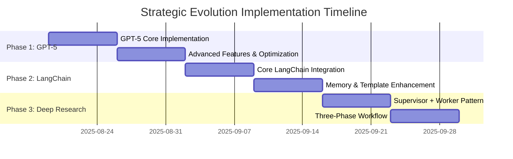

# ADR-013: Strategic Evolution - GPT-5, LangChain Enhancement, and Deep Research Integration

**Status**: PROPOSED  
**Date**: August 19, 2025  
**Authors**: Documentation & Developer Experience Specialist  
**Reviewers**: TBD  
**Strategic Priority**: CRITICAL - Foundation for next evolution phase

---

## 🚀 Strategic Context

Following comprehensive strategic analysis, CogniVault has reached a critical evolution point where three major technology integrations can dramatically enhance our cognitive platform capabilities. This ADR documents our strategic roadmap for integrating GPT-5, enhancing LangChain utilization, and incorporating Deep Research patterns while preserving our unique cognitive architecture advantages.

## 🎯 Strategic Analysis Summary

### Current State Assessment
- **LangChain Utilization**: Approximately 30% of available capabilities utilized
- **GPT Model Strategy**: GPT-4 based with structured output challenges (~90% success rate)
- **Research Patterns**: Basic orchestration without advanced research methodologies
- **Unique Value**: Strong cognitive architecture, advanced node types, persistent knowledge substrate

### Strategic Opportunity Identification

#### 1. GPT-5 Integration (PRIORITY 1)
**Business Impact**: Highest ROI with immediate benefits
- **Structured Output Reliability**: 99% success rate (vs current ~90%)
- **Hallucination Reduction**: 45% fewer hallucinations = higher agent reliability
- **Enhanced Reasoning**: 94.6% AIME score with improved mathematical and logical reasoning
- **Cost Optimization**: Potential cost reduction through efficiency gains
- **Perfect Timing**: Aligns with Issue 018 structured outputs implementation

#### 2. LangChain Enhancement (PRIORITY 2)
**Current Gap Analysis**: Missing 70% of LangChain capabilities
- **Document Processing**: No document loaders, text splitters
- **Retrieval Components**: Limited RAG implementation
- **Tool Ecosystem**: Minimal tool integration
- **Memory Management**: No conversation memory
- **Prompt Templates**: Basic template system

**Integration Opportunity**: LangChain complements our architecture
- **Input Processing**: LangChain handles document ingestion and preprocessing
- **Output Validation**: Pydantic AI ensures structured, validated outputs
- **Orchestration**: LangGraph maintains our advanced workflow patterns

#### 3. Deep Research Patterns (PRIORITY 3)
**Valuable Pattern Integration**:
- **Supervisor + Worker**: Aligns with our advanced node types
- **Three-Phase Workflow**: Scope → Research → Synthesis
- **Evaluation Frameworks**: Quality metrics and validation
- **Parallel Execution**: Optimization patterns
- **Modular Architecture**: Agent composition strategies

## 📊 Strategic Decision Framework

### Why GPT-5 First?
**CRITICAL INSIGHT**: GPT-5 integration should precede Issue 018 completion because:

1. **Foundation Enhancement**: Native structured outputs make agent implementation more reliable
2. **Reasoning Quality**: Enhanced reasoning traces improve all cognitive capabilities
3. **Validation Simplification**: Better conformance reduces validation complexity
4. **Issue 018 Synergy**: Structured outputs implementation benefits from GPT-5 capabilities

### Architectural Harmony Strategy
**Three-Layer Enhancement**:
```
┌─────────────────┐
│   LangChain     │  ← Input Processing & RAG
│  (Enhanced)     │
├─────────────────┤
│   Pydantic AI   │  ← Structured Output Validation
│  (GPT-5 Core)   │
├─────────────────┤
│   LangGraph     │  ← Advanced Orchestration
│  (Our Strength) │
└─────────────────┘
```

## 🎯 Unified Strategic Roadmap

### Phase 1: GPT-5 Integration (Weeks 1-2) - PRIORITY 1

#### Week 1: Core GPT-5 Implementation
**Objectives**: Replace GPT-4 with GPT-5 across all agent interactions
- **OpenAI Client Upgrade**: Update to latest client supporting GPT-5
- **Schema Enhancement**: Leverage native structured outputs for agent schemas
- **Reasoning Traces**: Implement enhanced reasoning trace collection
- **Backward Compatibility**: Maintain GPT-4 fallback strategy

**Deliverables**:
- [ ] GPT-5 client integration with fallback mechanism
- [ ] Enhanced structured output schemas for all agents
- [ ] Reasoning trace collection and storage
- [ ] Performance benchmarking vs GPT-4 baseline

#### Week 2: Advanced Features & Optimization
**Objectives**: Leverage GPT-5 unique capabilities for enhanced agent behavior
- **Advanced Reasoning**: Implement enhanced mathematical and logical reasoning
- **Error Reduction**: Deploy hallucination reduction strategies
- **Cost Optimization**: Implement efficiency monitoring and optimization
- **Quality Metrics**: Establish GPT-5 specific performance benchmarks

**Deliverables**:
- [ ] Advanced reasoning capabilities in Critic and Synthesis agents
- [ ] Hallucination detection and mitigation strategies
- [ ] Cost monitoring and optimization dashboard
- [ ] A/B testing framework for GPT-4 vs GPT-5 comparison

### Phase 2: LangChain Enhancement (Weeks 3-4) - PRIORITY 2

#### Week 3: Core LangChain Integration
**Objectives**: Dramatically enhance Historian and input processing capabilities
- **Document Loaders**: Implement comprehensive document ingestion
- **Text Splitters**: Advanced chunking strategies for better RAG
- **Retrieval Components**: Enhanced vector search and hybrid retrieval
- **Tool Integration**: Expand tool ecosystem integration

**Deliverables**:
- [ ] Document loader integration for PDF, Word, web content
- [ ] Advanced text chunking with semantic awareness
- [ ] Hybrid retrieval system (vector + keyword + graph)
- [ ] Tool ecosystem integration (web search, APIs, calculators)

#### Week 4: Memory & Template Enhancement
**Objectives**: Implement conversation memory and advanced prompt templates
- **Conversation Memory**: Persistent context across sessions
- **Prompt Templates**: Advanced template system with variables
- **Chain Composition**: Complex chain patterns for research workflows
- **Integration Testing**: Comprehensive LangChain + Pydantic AI validation

**Deliverables**:
- [ ] Conversation memory system with PostgreSQL persistence
- [ ] Advanced prompt template system with cognitive awareness
- [ ] Complex chain composition for research workflows
- [ ] Integration test suite for LangChain + Pydantic AI harmony

### Phase 3: Deep Research Patterns (Weeks 5-6) - PRIORITY 3

#### Week 5: Supervisor + Worker Implementation
**Objectives**: Implement advanced research orchestration patterns
- **Supervisor Agent**: Research coordination and task delegation
- **Worker Specialization**: Domain-specific research agents
- **Parallel Execution**: Optimized parallel research strategies
- **Quality Gates**: Research validation and quality control

**Deliverables**:
- [ ] Supervisor agent for research orchestration
- [ ] Specialized worker agents for different research domains
- [ ] Parallel execution optimization for research tasks
- [ ] Quality validation framework for research outputs

#### Week 6: Three-Phase Workflow & Evaluation
**Objectives**: Implement comprehensive research methodology
- **Scope Phase**: Research question analysis and strategy formation
- **Research Phase**: Parallel information gathering and analysis
- **Synthesis Phase**: Integration and output generation
- **Evaluation Framework**: Quality metrics and continuous improvement

**Deliverables**:
- [ ] Three-phase research workflow implementation
- [ ] Comprehensive evaluation framework with quality metrics
- [ ] Research methodology documentation and examples
- [ ] Performance benchmarking against existing workflows

## 🎯 Success Criteria & Metrics

### Phase 1: GPT-5 Integration Success Metrics
- **Structured Output Reliability**: >95% success rate (target: 99%)
- **Hallucination Reduction**: <50% of current hallucination rate
- **Reasoning Quality**: Measurable improvement in logical and mathematical tasks
- **Performance**: Maintain <30 second total workflow time
- **Cost Efficiency**: Cost/quality ratio improvement measurement

### Phase 2: LangChain Enhancement Success Metrics
- **Document Processing**: Support for 5+ document types with 95% accuracy
- **Retrieval Quality**: >85% retrieval accuracy in hybrid search scenarios
- **Tool Integration**: 10+ integrated tools with seamless orchestration
- **Memory Effectiveness**: Persistent context improving subsequent interactions by >30%
- **Template Flexibility**: Support for complex prompt composition with cognitive awareness

### Phase 3: Deep Research Success Metrics
- **Research Thoroughness**: >90% coverage of relevant research dimensions
- **Quality Consistency**: Consistent quality across parallel research streams
- **Time Efficiency**: Research tasks completed 40% faster than current approach
- **Evaluation Accuracy**: Research quality assessment >85% correlation with expert evaluation
- **Scalability**: Support for complex research topics with 10+ sub-questions

## 🚨 Risk Mitigation Strategies

### Technical Risks
1. **GPT-5 Availability**: Fallback to GPT-4 with feature degradation warnings
2. **LangChain Breaking Changes**: Version pinning with gradual upgrade strategy
3. **Performance Degradation**: Comprehensive benchmarking with rollback triggers
4. **Integration Complexity**: Incremental integration with comprehensive testing

### Business Risks
1. **Cost Escalation**: Cost monitoring with automatic scaling limits
2. **Quality Regression**: A/B testing with automatic rollback on quality metrics
3. **Timeline Delays**: Parallel development streams with independent delivery
4. **User Experience Impact**: Gradual rollout with user feedback integration

### Strategic Risks
1. **Architectural Misalignment**: Preserve CogniVault's unique cognitive advantages
2. **Over-Engineering**: Focus on high-value integrations with clear ROI
3. **Ecosystem Fragmentation**: Maintain unified platform experience
4. **Community Impact**: Ensure backward compatibility and upgrade paths

## 🏗️ Architectural Preservation Strategy

### CogniVault Unique Advantages (PRESERVE)
1. **Cognitive Architecture**: Dual-process theory, metacognitive monitoring
2. **Persistent Knowledge Substrate**: Knowledge evolution, long-term memory
3. **Advanced Node Types**: Decision/Aggregator/Validator/Terminator patterns
4. **Multi-Axis Classification**: 6-axis intelligent routing system
5. **Event-Driven Observability**: Comprehensive correlation tracking
6. **Configurable Prompt Composition**: YAML-driven agent behaviors

### Integration Principles
1. **Enhancement, Not Replacement**: Enhance existing capabilities rather than replace
2. **Cognitive Awareness**: Integrate new components with cognitive architecture
3. **Observability Continuity**: Maintain comprehensive event tracking
4. **Configuration Driven**: Preserve YAML-based configuration approach
5. **Platform Modularity**: Maintain platform architecture for ecosystem growth

## 🎯 Strategic Pivot Recommendation

### Immediate Action: GPT-5 Integration Priority
**RECOMMENDED APPROACH**: Pivot current development focus to GPT-5 integration before completing Issue 018

**Rationale**:
1. **Foundation First**: GPT-5 provides better foundation for structured outputs
2. **Multiplier Effect**: Enhanced reasoning improves all agent capabilities
3. **Strategic Timing**: Early GPT-5 adoption provides competitive advantage
4. **Issue 018 Synergy**: Structured outputs implementation benefits from GPT-5 native capabilities

### Resource Allocation
- **Week 1-2**: 100% focus on GPT-5 integration (all available development resources)
- **Week 3-4**: 80% LangChain enhancement, 20% GPT-5 optimization
- **Week 5-6**: 70% Deep Research patterns, 30% integration testing and optimization

## 🔄 Implementation Timeline



## 📋 Decision Record

### Decisions Made
1. **GPT-5 Priority**: GPT-5 integration takes priority over Issue 018 completion
2. **LangChain Enhancement**: Comprehensive LangChain integration to leverage 70% unused capabilities
3. **Deep Research Integration**: Selective pattern integration preserving CogniVault advantages
4. **Architectural Harmony**: Three-layer enhancement strategy (LangChain + Pydantic AI + LangGraph)
5. **Risk-First Approach**: Comprehensive fallback and rollback strategies for all integrations

### Alternatives Considered
1. **Issue 018 First**: Rejected due to GPT-5 synergy benefits
2. **Sequential Integration**: Rejected in favor of strategic priority approach
3. **Minimal LangChain Integration**: Rejected due to significant capability gaps
4. **Deep Research First**: Rejected due to foundation dependency on GPT-5 improvements

### Success Dependencies
1. **GPT-5 Availability**: API access and performance characteristics
2. **LangChain Stability**: Version compatibility and breaking change management
3. **Team Capacity**: Development resources for parallel integration streams
4. **Testing Infrastructure**: Comprehensive validation for complex integrations

## 🎯 Next Steps

### Immediate Actions (Week 1)
1. **GPT-5 API Access**: Secure GPT-5 API access and quota allocation
2. **Development Environment**: Setup GPT-5 testing and development environment
3. **Baseline Metrics**: Establish comprehensive performance baselines for comparison
4. **Team Alignment**: Brief team on strategic pivot and new priorities

### Success Tracking
1. **Daily Standups**: Progress tracking with metric-based success criteria
2. **Weekly Reviews**: Strategic milestone assessment and course correction
3. **Integration Testing**: Continuous integration validation for all changes
4. **Performance Monitoring**: Real-time monitoring of success metrics and rollback triggers

---

**This ADR represents a strategic inflection point for CogniVault, positioning us to leverage the best of emerging AI capabilities while preserving our unique cognitive architecture advantages. The unified roadmap ensures systematic enhancement while maintaining our platform vision and competitive differentiation.**