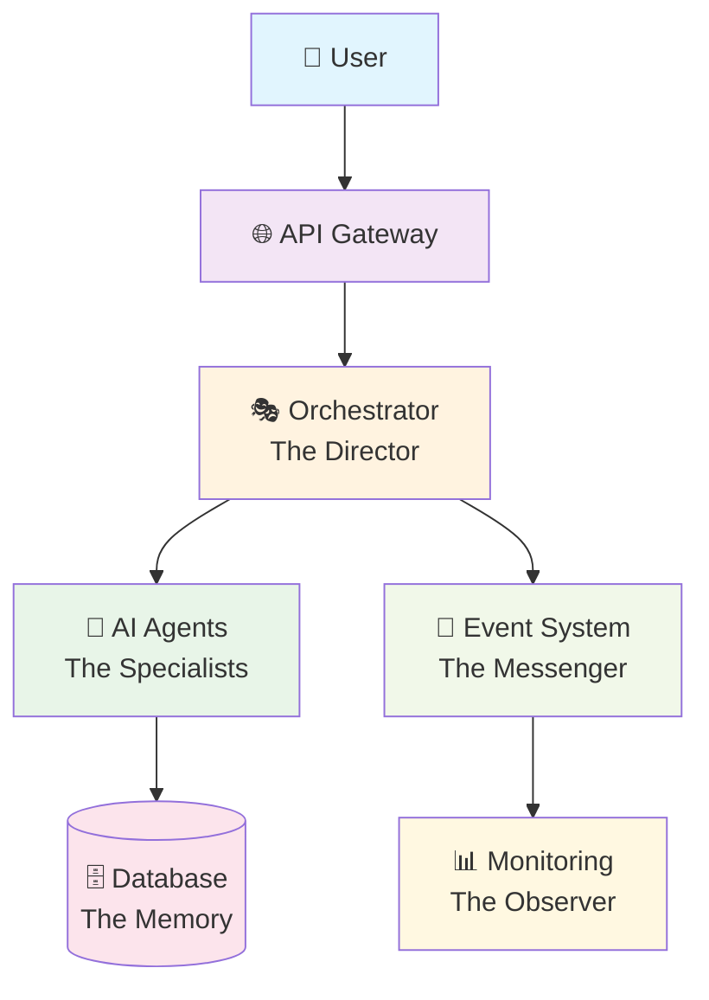
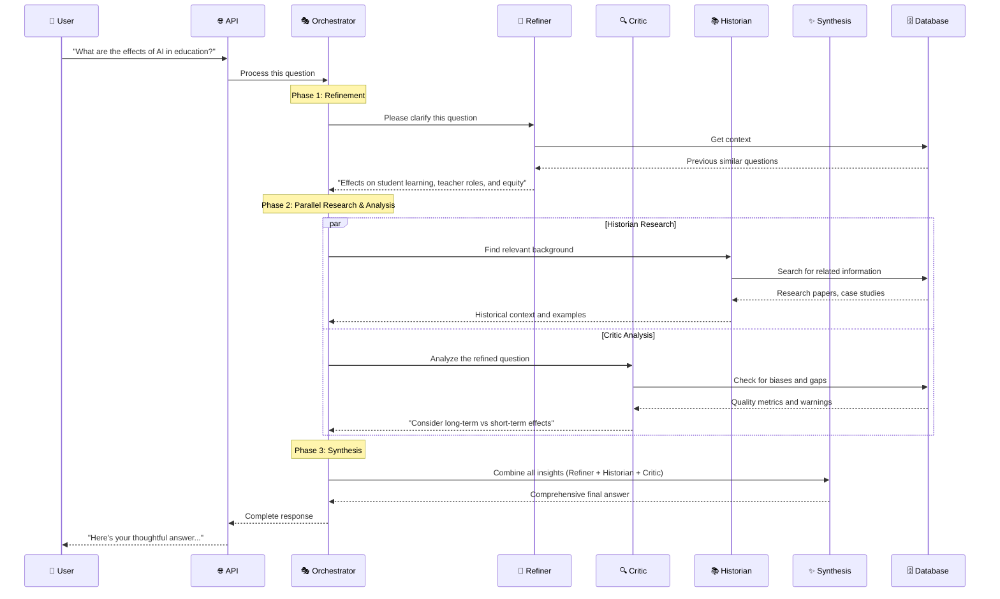
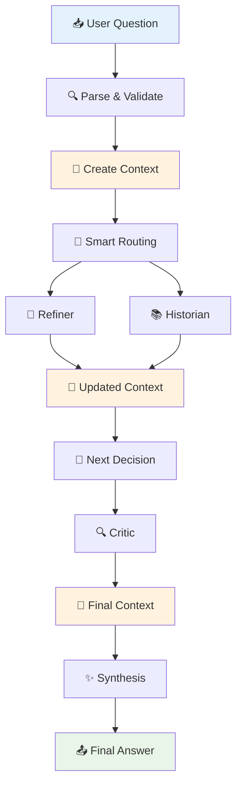

# 🧠 CogniVault Architecture Guide
*A Beginner-Friendly Journey Through Multi-Agent Intelligence*

---

## 🎯 What is CogniVault?

Think of CogniVault as a **digital think tank** where multiple AI specialists work together to answer complex questions. Just like a human consulting team has researchers, critics, historians, and synthesizers, CogniVault has specialized AI agents that collaborate to provide thoughtful, well-researched responses.

> **Real-world analogy**: Imagine you're planning a wedding. You'd consult a planner (Refiner), get feedback from friends (Critic), research past events (Historian), and pull it all together (Synthesis). CogniVault does this digitally with AI agents.

---

## 🏗️ System Overview: The Big Picture

CogniVault is built like a **modern factory** with four main production areas:



### 🎭 **The Director (Orchestrator)**
- **What it does**: Manages the entire workflow, like a movie director
- **Key responsibility**: Decides which agents run when, handles errors, tracks progress
- **Files to explore**: `src/cognivault/orchestration/`

### 🤖 **The Specialists (AI Agents)**
- **What they do**: Four focused AI experts, each with a specific job
- **Key responsibility**: Process information in their area of expertise
- **Files to explore**: `src/cognivault/agents/`

### 🗄️ **The Memory (Database + Context)**
- **What it does**: Stores everything the system learns and remembers
- **Key responsibility**: Provides historical knowledge and tracks current thinking
- **Files to explore**: `src/cognivault/database/`, `src/cognivault/context.py`

### 📡 **The Messenger (Event System)**
- **What it does**: Broadcasts what's happening in real-time
- **Key responsibility**: Keeps everyone informed about progress and problems
- **Files to explore**: `src/cognivault/events/`

---

## 🎪 Meet the AI Agent Team

Each agent is like a specialist consultant with a unique personality and expertise:

### 🔧 **Refiner Agent** - *The Clarifier*

```python
# What the Refiner does
"Your question is vague. Let me make it more precise and actionable."
```

- **Personality**: Analytical, detail-oriented
- **Job**: Takes messy questions and makes them crystal clear
- **Human equivalent**: The person who asks "What exactly do you mean by that?"

### 🔍 **Critic Agent** - *The Quality Controller*

```python
# What the Critic does  
"That answer looks good, but have you considered these potential biases?"
```

- **Personality**: Skeptical, thorough
- **Job**: Finds holes, biases, and improvements
- **Human equivalent**: The devil's advocate who makes everything better

### 📚 **Historian Agent** - *The Researcher*

```python
# What the Historian does
"Based on similar questions, here's relevant background information..."
```

- **Personality**: Knowledgeable, methodical
- **Job**: Finds relevant historical information and context
- **Human equivalent**: The librarian who knows where everything is

### ✨ **Synthesis Agent** - *The Composer*

```python
# What the Synthesis does
"Taking all perspectives together, here's the comprehensive answer..."
```

- **Personality**: Integrative, creative
- **Job**: Combines everyone's input into a polished final answer
- **Human equivalent**: The editor who makes everything flow beautifully

---

## 🔄 How It All Works: The Journey of a Question

Let's follow a question through the system step by step, showing how CogniVault uses **parallel processing** to maximize efficiency:



### 🚦 **The Traffic Control System**

The Orchestrator orchestrates this **fan-out/fan-in pattern** efficiently:

#### **🔄 Execution Flow:**
1. **Sequential Start**: Refiner clarifies the question first (essential foundation)
2. **Parallel Fan-out**: Historian and Critic run **simultaneously** (maximum efficiency)
3. **Fan-in Synthesis**: All outputs combine into the final answer

#### **🎯 Smart Routing with 6-Axis Classification:**
The Orchestrator uses a sophisticated classification system (think of it like a GPS for thoughts):

1. **Speed**: Fast thinking vs deep thinking
2. **Depth**: Surface level vs comprehensive analysis
3. **Pattern**: Simple vs complex processing
4. **Role**: Entry point, middle step, or final output
5. **Type**: Processing, deciding, combining, or validating
6. **Context**: What domain are we working in?

This helps the system choose the right approach and determine which agents can run in parallel automatically.

> **Performance Benefit**: Running Historian and Critic in parallel cuts total processing time nearly in half compared to sequential execution!

---

## 🎨 Design Patterns & Principles

### 🎭 **The Theater Pattern (Orchestration)**

```python 
# Like directing a play
class Orchestrator:
    def direct_performance(self, script):
        # Set the stage
        context = self.prepare_stage(script)

        # Each actor performs their role
        for actor in self.cast:
            actor.perform(context)

        # Bring it all together
        return self.final_bow(context)
```

**Why this pattern?**
- **Flexibility**: Easy to add new "actors" (agents)
- **Control**: Central coordination prevents chaos
- **Reliability**: If one actor fails, the show goes on

### 🔌 **The Plugin Pattern (Agent System)**

```python
# Each agent is a specialized plugin
class BaseAgent:
    def execute(self, context):
        # Every agent follows the same interface
        pass

class RefinerAgent(BaseAgent):
    def execute(self, context):
        # But each does something unique
        return self.clarify_question(context.query)
```

**Why this pattern?**
- **Extensibility**: Easy to add new agent types
- **Consistency**: All agents work the same way
- **Testing**: Each agent can be tested independently

### 📡 **The Observer Pattern (Event System)**

```python
# Like a news broadcaster
class EventSystem:
    def broadcast(self, event):
        # Tell everyone what just happened
        for listener in self.listeners:
            listener.notify(event)
```

**Why this pattern?**
- **Transparency**: See what's happening in real-time
- **Debugging**: Track down problems easily
- **Integration**: Other systems can listen in

### 💾 **The Snapshot Pattern (Context Management)**

```python
# Like saving your game progress
class AgentContext:
    def create_snapshot(self):
        # Save current state
        return self.freeze_current_state()

    def rollback(self, snapshot):
        # Go back if something goes wrong
        self.restore_state(snapshot)
```

**Why this pattern?**
- **Safety**: Can undo mistakes
- **Experimentation**: Try different approaches
- **Reliability**: Recover from failures gracefully

---

## 🛠️ Technology Stack: The Toolbox

### 🏗️ **The Foundation**

```python
# Python 3.12 - The language
# Poetry - Dependency management (like npm for Python)
# FastAPI - Web framework (super fast, auto-documentation)
# Pydantic - Data validation (prevents bad data from breaking things)
```

### 🧠 **The Intelligence**

```python
# OpenAI API - The actual AI brains
# LangGraph - Workflow orchestration (like a flowchart that executes)
# Pydantic AI - Structured AI responses
```

### 🗄️ **The Storage**

```python
# PostgreSQL - Main database (reliable, powerful)
# pgvector - Vector search (finds similar things)
# Redis - Fast cache (quick temporary storage)
```

### 📊 **The Monitoring**

```python
# Loguru - Beautiful logging
# Rich - Pretty terminal output
# Custom event system - Real-time monitoring
```

**Why these choices?**
- **Python**: Readable, great AI ecosystem
- **FastAPI**: Modern, fast, self-documenting
- **PostgreSQL**: Battle-tested, handles complex queries
- **Pydantic**: Prevents bugs with automatic validation

---

## 🗺️ Data Flow: Following the Information

### **The Information Highway**



### **The Context: The System's Brain**

Think of Context as the system's **working memory**:

```python
class AgentContext:
    query: str                    # The original question
    agent_outputs: Dict          # What each agent produced  
    retrieved_notes: List        # Relevant background info
    execution_state: Dict        # Where we are in the process
    snapshots: List             # Saved states for rollback

    # Like a shared whiteboard that all agents can see and write on
```

> **Key insight**: Unlike humans who forget things, CogniVault remembers everything that happened during processing and can backtrack if needed.

---

## 🏗️ Key Architecture Decisions

### ✅ **What We Chose & Why**

#### **Centralized Orchestration**
- **Decision**: One orchestrator manages all agents
- **Why**: Prevents chaos, enables complex workflows
- **Trade-off**: Single point of control (but with great power...)

#### **Immutable Context Snapshots**
- **Decision**: Save state at every major step
- **Why**: Can recover from errors, debug problems
- **Trade-off**: Uses more memory but worth it for reliability

#### **Event-Driven Monitoring**
- **Decision**: Broadcast everything that happens
- **Why**: Complete transparency, easy debugging
- **Trade-off**: Slight performance overhead but invaluable for troubleshooting

#### **Strong Type Safety**
- **Decision**: Pydantic models everywhere
- **Why**: Catches bugs early, self-documenting
- **Trade-off**: More code to write but prevents runtime errors

### ⚖️ **The Big Trade-offs**

  | We Chose            | Instead Of        | Why                                   |
  |---------------------|-------------------|---------------------------------------|
  | Rich Context        | Minimal state     | Better debugging, rollback capability |
  | Type Safety         | Quick & dirty     | Fewer bugs, better maintainability    |
  | Centralized Control | Fully distributed | Simpler coordination, easier testing  |
  | PostgreSQL          | NoSQL             | Complex queries, ACID transactions    |

---

## 🎓 Developer Onboarding Guide

### 🚀 **Week 1: Getting Your Bearings**

#### **Start Here (in order):**

1. **Read the README** - Get the big picture
2. **Run `make run QUESTION="test"`** - See it work
3. **Explore `src/cognivault/context.py`** - The system's brain
4. **Look at `src/cognivault/agents/refiner/`** - Simple agent example

#### **Your First Code Change:**

Try modifying the Refiner agent's prompt in `src/cognivault/agents/refiner/prompts.py` and see how it changes the output.

### 📚 **Week 2: Understanding the Flow**

#### **Follow This Path:**

1. **`src/cognivault/cli/`** - How commands start
2. **`src/cognivault/orchestration/`** - How workflows execute
3. **`src/cognivault/agents/`** - How agents work
4. **`tests/`** - How we ensure quality

#### **Try This:**

Write a simple test for an agent and run `make test` to see it work.

### 🛠️ **Week 3: Making Changes**

#### **The Development Flow:**

```bash
# 1. Make your change
vim src/cognivault/agents/refiner/main.py

# 2. Check your types
make typecheck

# 3. Run tests
make test

# 4. See it work
make run QUESTION="test my change"
```

### 📝 **Rules of the Road**

#### 🚫 **Don't Do This:**

- Modify `context.py` without understanding the full impact
- Add dependencies without checking with the team
- Skip type hints (MyPy will catch you!)
- Forget to write tests for new features

#### ✅ **Do This:**

- Follow the existing patterns (look for similar code first)
- Add logging to help with debugging
- Write tests that actually test meaningful behavior
- Ask questions in code reviews

#### 🆘 **When You're Stuck:**

1. **Read the ADRs** in `src/cognivault/docs/architecture/`
2. **Check the tests** - they show how things should work
3. **Look at git history** - see how similar changes were made
4. **Ask the team** - we're here to help!

---

## 🎯 Architecture Strengths & Growth Areas

### 🏆 **What We Do Really Well**

- **Type Safety**: Comprehensive validation prevents runtime errors
- **Testability**: 86% test coverage with clear test patterns
- **Observability**: Know exactly what's happening when
- **Modularity**: Easy to understand, modify, and extend individual pieces
- **Error Recovery**: Sophisticated rollback and retry mechanisms

### 🌱 **Areas for Growth**

- **Complexity**: Some files are getting large (looking at you, `context.py`)
- **Performance**: Could be more efficient with caching and async patterns
- **Configuration**: Multiple config systems could be unified
- **Documentation**: More code examples for complex patterns

### 🔮 **Future Considerations**

- **Multi-tenancy**: Supporting multiple customers
- **Real-time collaboration**: Agents working together live
- **Learning agents**: Agents that improve over time
- **Horizontal scaling**: Running on multiple servers

---

## 🎉 Congratulations!

You now understand how CogniVault works! Remember:

- **It's like a consulting team** - specialized experts working together
- **The Orchestrator is the director** - coordinates everything
- **Context is the shared brain** - remembers everything important
- **Events are the messenger** - broadcasts what's happening
- **Types keep us safe** - prevents bugs before they happen

### **Your Next Steps:**

1. Run the system and watch the logs
2. Make a small change and see what happens
3. Write a test for something you're curious about
4. Join the next architecture discussion - your fresh perspective is valuable!

**Welcome to the team! 🚀**

---

> *"The best architecture is the one that makes the complex feel simple and the impossible feel inevitable."*
