# Hybrid Search Flow Architecture

## Overview
The CogniVault Historian Hybrid Search system orchestrates multiple data sources to provide fast, comprehensive search results with intelligent fallback mechanisms.

## Flow Diagram

```mermaid
flowchart TD
    A[🔍 User Query] --> B{📋 Hybrid Search Enabled?}
    
    B -->|false| C[📄 File Search Only]
    B -->|true| D[⚡ Hybrid Search Mode]
    
    D --> E[📊 Calculate Search Limits]
    E --> F["File Limit = Total × file_ratio<br/>DB Limit = Total - File Limit"]
    
    F --> G[📄 File Search Task]
    F --> H[🗄️ Database Search Task]
    
    G --> I{✅ File Results?}
    H --> J{✅ DB Results?}
    
    I -->|Success| K[📄 File Results<br/>Base Score]
    I -->|Failure| L[⚠️ Log Error<br/>Continue with DB]
    J -->|Success| M[📊 DB Results<br/>+ relevance_boost]
    J -->|Failure| N[⚠️ Log Error<br/>Continue with File]
    
    K --> O[🔄 Merge & Deduplicate]
    M --> O
    L --> O
    N --> O
    
    O --> P[📈 Rank by Relevance Score]
    P --> Q[✂️ Apply Total Result Limit]
    Q --> R[🎯 Enhanced Results]
    R --> S[📤 Return to User]
    
    C --> T[📄 Direct File Return]
    T --> S
    
    style A fill:#e1f5fe
    style D fill:#f3e5f5
    style O fill:#e8f5e8
    style R fill:#fff3e0
    style S fill:#e8f5e8
```



## Decision Logic

### Hybrid Search Configuration
- **`hybrid_search_enabled=False`**: Legacy mode, files-only search
- **`hybrid_search_enabled=True`** (recommended): Hybrid execution with configurable file/database split

### Fallback Mechanisms
1. **Database Failure** → Continue with markdown results only
2. **Markdown Failure** → Continue with database results only  
3. **Both Fail** → Return empty results with detailed error logging
4. **Partial Success** → Merge available results, log issues

### Performance Characteristics
- **Hybrid Mode**: ~200ms typical response time (file + database)
- **File Only Mode**: ~2-5s response time (legacy baseline)
- **Database Search**: ~50-100ms when available
- **Deduplication Overhead**: <20ms for similarity calculation

## Example Execution Flows

### Successful Hybrid Search
```
User: "machine learning algorithms" (limit=10)
├── File Search: 6 results (60% × 10) ✅
├── DB Search: 4 results (40% × 10) ✅  
├── Merge: 9 unique results (1 duplicate removed)
├── Rank: [DB1+boost, FILE1, DB2+boost, FILE2, ...]
└── Return: Top 9 results
```

### Database Fallback Scenario
```  
User: "deep learning neural networks" (limit=10)
├── File Search: 6 results ✅
├── DB Search: Connection timeout ❌
├── Fallback: Continue with file results only
├── Log: "Database search failed, using file fallback"
└── Return: 6 file results
```

### Emergency Fallback Mode
```
Environment: HISTORIAN_HYBRID_SEARCH_ENABLED=false
├── Skip: Database search entirely
├── Execute: File search only (resilient processor)
├── Log: "File-only mode active"
└── Return: File results only
```

## Configuration Examples

### Production Configuration
```python
config = HistorianConfig(
    hybrid_search_enabled=True,
    hybrid_search_file_ratio=0.6,      # 60% file, 40% database
    database_relevance_boost=0.2,      # +0.2 boost for database results
    search_timeout_seconds=5,           # 5s timeout
    deduplication_threshold=0.8         # 80% similarity threshold
)
```

### Emergency Fallback Configuration
```python
# Environment variable approach
HISTORIAN_HYBRID_SEARCH_ENABLED=false

# Or programmatic override
config = HistorianConfig(
    hybrid_search_enabled=False,       # Emergency file-only mode
    search_timeout_seconds=30          # Longer timeout for file-only
)
```

## Monitoring Points

### Key Metrics to Track
- **Hybrid Success Rate**: Both sources return results
- **Fallback Frequency**: How often fallbacks occur
- **Source Performance**: DB vs MD response times
- **Result Quality**: User interaction with results
- **Error Patterns**: Common failure modes

### Alerting Thresholds
- **Database failure rate > 5%** → Page on-call
- **Average response time > 1s** → Investigate performance
- **Fallback rate > 20%** → Review system health
- **Zero results rate > 10%** → Check corpus quality