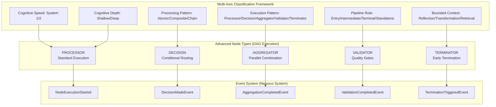

# AAD-002: Multi-Axis Classification and Advanced Node Types Integration

## Document Type
**Architectural Analysis Document (AAD)**

## Status
**Active Implementation** - Integration Complete

## Abstract

This document synthesizes the multi-axis agent classification system with advanced node types implementation to create a unified architectural framework for CogniVault's composable, multi-dimensional orchestration system. Building on AAD-001's cognitive vs utility taxonomy and the event system consolidation work, this analysis establishes how the execution pattern axis complements existing classification dimensions to enable sophisticated workflow orchestration.

## Architectural Evolution: From Agent Pipeline to Composable Orchestration

### Previous State: Linear Agent Pipeline
```
🔍 Refiner → 🧾 Historian → 🧠 Critic → 🧵 Synthesis
```

### Current State: Multi-Dimensional Orchestration System
```
📊 Multi-Axis Classification Framework
├── Cognitive Classification (AAD-001)
├── Task Classification (Events System)
└── Execution Pattern Classification (NEW)
         ↓
🧩 Advanced Node Types (DAG Execution)
├── PROCESSOR (Standard agent execution)
├── DECISION (Conditional routing and flow control)
├── AGGREGATOR (Parallel output combination)
├── VALIDATOR (Quality gates and checkpoints)
└── TERMINATOR (Early termination and confidence thresholds)
```

## Multi-Axis Classification Framework

### Axis 1: Cognitive Classification (System 1/2 Mental Model)
**Source**: `AgentMetadata.cognitive_speed` and `AgentMetadata.cognitive_depth`

| Axis | Values | Purpose | System Mapping |
|------|--------|---------|----------------|
| `cognitive_speed` | `["fast", "slow", "adaptive"]` | Processing speed characteristics | System 1 (fast) vs System 2 (slow) |
| `cognitive_depth` | `["shallow", "deep", "variable"]` | Depth of analytical processing | Utility (shallow) vs Cognitive (deep) |

**Example Classification**:
```python
# Utility Agent (System 1)
cognitive_speed="fast", cognitive_depth="shallow"

# Cognitive Agent (System 2)  
cognitive_speed="slow", cognitive_depth="deep"

# Adaptive Agent
cognitive_speed="adaptive", cognitive_depth="variable"
```

### Axis 2: Task Classification (Intent-Based Routing)
**Source**: `TaskClassification.task_type`

**Core Task Types** (as originally specified):
| Task Type | Purpose | Agent Mapping |
|-----------|---------|---------------|
| `transform` | Data/format transformation | Translation, Summarization |
| `evaluate` | Critical analysis and assessment | Critic, Validator |
| `retrieve` | Information and context retrieval | Historian |
| `synthesize` | Multi-perspective integration | Synthesis |
| `clarify` | Intent clarification and refinement | Refiner |

**Extended Task Types** (implementation enhancement):
| Task Type | Purpose | Agent Mapping |
|-----------|---------|---------------|
| `summarize` | Content condensation and abstraction | Summarization agents |
| `format` | Output structure and presentation | Formatting utilities |
| `filter` | Content filtering and selection | Content processors |
| `rank` | Priority ordering and scoring | Ranking algorithms |
| `compare` | Comparative analysis | Comparison engines |
| `explain` | Educational content generation | Explanation agents |

*Implementation Note*: TaskClassification supports 11 total task types (5 core + 6 extended) with backward compatibility maintained.

### Axis 3: Processing Pattern (Workflow Composition)
**Source**: `AgentMetadata.processing_pattern`

| Pattern | Description | Use Cases |
|---------|-------------|-----------|
| `atomic` | Single, indivisible operation | Utility functions, simple transforms |
| `composite` | Multi-step operation requiring planning | Complex analysis workflows |
| `chain` | Sequential operation dependency | Pipeline processing |

### Axis 4: Pipeline Role (Position-Based Classification)
**Source**: `AgentMetadata.pipeline_role`

| Role | Description | Responsibilities |
|------|-------------|------------------|
| `entry` | Entry point for workflows | Input validation, initial processing |
| `intermediate` | Middle processing steps | Analysis, transformation |
| `terminal` | Final output generation | Response formatting, synthesis |
| `standalone` | Independent operation | Utility functions, micro-services |

### Axis 5: Bounded Context (Domain-Driven Design)
**Source**: `AgentMetadata.bounded_context`

| Context | Domain | Language/Entities |
|---------|--------|-------------------|
| `reflection` | Deep analytical processing | Insights, Perspectives, Conflicts |
| `transformation` | Functional transformations | Documents, Data, Formats |
| `retrieval` | Information gathering | Context, Memory, Knowledge |

### **NEW** Axis 6: Execution Pattern (Advanced Node Types)
**Source**: `AgentMetadata.execution_pattern`

| Pattern | Node Type | Role in Execution | Event Integration |
|---------|-----------|-------------------|-------------------|
| `processor` | `PROCESSOR` | Standard agent execution (default) | `AgentExecutionStartedEvent` |
| `decision` | `DECISION` | Conditional routing and flow control | `DecisionMadeEvent` |
| `aggregator` | `AGGREGATOR` | Parallel output combination and synthesis | `AggregationCompletedEvent` |
| `validator` | `VALIDATOR` | Quality gates and checkpoint validation | `ValidationCompletedEvent` |
| `terminator` | `TERMINATOR` | Early termination and confidence thresholds | `TerminationTriggeredEvent` |

## Advanced Node Types: Execution Pattern Implementation

### Node Type Compatibility Matrix

| Node Type | execution_pattern | Use Cases | Expected Events | Can Fork? | Can Aggregate? | LangGraph Equivalent |
|-----------|-------------------|-----------|-----------------|-----------|----------------|---------------------|
| **PROCESSOR** | `processor` | Standard agent execution | `AgentExecutionStarted/Completed` | ✅ | ❌ | Node |
| **DECISION** | `decision` | Conditional routing, flow control | `DecisionMadeEvent` | ✅ | ❌ | Conditional edge/branching |
| **AGGREGATOR** | `aggregator` | Parallel output combination | `AggregationCompletedEvent` | ❌ | ✅ | Gather/join nodes |
| **VALIDATOR** | `validator` | Quality gates, checkpoints | `ValidationCompletedEvent` | ✅ | ❌ | Guard rails/edge validation |
| **TERMINATOR** | `terminator` | Early termination, confidence thresholds | `TerminationTriggeredEvent` | ❌ | ❌ | End node/early return |

### Node Interoperability Rules

#### Data Flow Compatibility
- **PROCESSOR → ANY**: Can output to any node type
- **DECISION → PROCESSOR/VALIDATOR/TERMINATOR**: Routes to execution paths
- **AGGREGATOR ← PROCESSOR/DECISION**: Combines outputs from parallel nodes
- **VALIDATOR → PROCESSOR/TERMINATOR**: Gates can route to execution or termination
- **TERMINATOR ← ANY**: Can receive termination signals from any node

#### Metadata Flow Requirements
All nodes must propagate core classification metadata:
```python
class NodeExecutionContext:
    correlation_id: str
    workflow_id: str
    cognitive_classification: Dict[str, str]
    task_classification: TaskClassification
    execution_path: List[str]  # Tracks node sequence
    confidence_score: Optional[float]
    resource_usage: Dict[str, Any]
```

#### Error Handling & Fallback Strategy
```python
# Node fallback hierarchy based on execution_pattern
FALLBACK_PATTERNS = {
    "decision": ["processor", "terminator"],      # Decision fails → process or terminate
    "aggregator": ["processor", "validator"],     # Aggregation fails → single process or validate
    "validator": ["processor", "terminator"],     # Validation fails → process or terminate  
    "processor": ["terminator"],                  # Processor fails → terminate
    "terminator": []                              # Terminator is final fallback
}
```

## Advanced Node Types: Execution Pattern Implementation

### PROCESSOR Nodes (Default)
**Execution Pattern**: `"processor"`
**Purpose**: Standard single-agent processing - existing agent behavior
**Event Pattern**: 
```python
emit_agent_execution_started() → emit_agent_execution_completed()
```

**Examples**:
```python
# Cognitive processor
AgentMetadata(
    name="critic",
    cognitive_speed="slow",
    cognitive_depth="deep", 
    execution_pattern="processor",
    primary_capability="critical_analysis"
)

# Utility processor  
AgentMetadata(
    name="translator",
    cognitive_speed="fast",
    cognitive_depth="shallow",
    execution_pattern="processor", 
    primary_capability="translation"
)
```

### DECISION Nodes
**Execution Pattern**: `"decision"`
**Purpose**: Conditional routing and workflow control structures
**Event Pattern**:
```python
emit_routing_decision() → DecisionMadeEvent
```

**Use Cases**:
- Query complexity-based routing
- Agent performance-based decisions
- Resource availability routing
- Confidence threshold routing

**Example**:
```python
AgentMetadata(
    name="complexity_router",
    cognitive_speed="fast",
    cognitive_depth="shallow",
    execution_pattern="decision",
    primary_capability="routing_decision",
    bounded_context="reflection"
)
```

### AGGREGATOR Nodes
**Execution Pattern**: `"aggregator"`
**Purpose**: Combine outputs from parallel agent execution
**Event Pattern**:
```python
AggregationCompletedEvent → aggregated_output
```

**Aggregation Strategies**:
- **Consensus**: Find common themes across outputs
- **Weighted**: Combine based on agent confidence scores
- **Hierarchical**: Prioritize based on agent types
- **Custom**: Domain-specific aggregation logic

**Example**:
```python
AgentMetadata(
    name="multi_perspective_aggregator",
    cognitive_speed="adaptive", 
    cognitive_depth="deep",
    execution_pattern="aggregator",
    primary_capability="multi_perspective_synthesis",
    processing_pattern="composite"
)
```

### VALIDATOR Nodes
**Execution Pattern**: `"validator"`
**Purpose**: Quality assurance checkpoints and gates
**Event Pattern**:
```python
ValidationCompletedEvent → pass/fail + detailed_feedback
```

**Validation Criteria**:
- **Content Quality**: Completeness, accuracy checks
- **Format Compliance**: Output structure validation
- **Safety Checks**: Ethical and safety guidelines
- **Custom Validators**: Domain-specific validation

**Example**:
```python
AgentMetadata(
    name="quality_gate",
    cognitive_speed="fast",
    cognitive_depth="deep",
    execution_pattern="validator", 
    primary_capability="quality_assurance",
    pipeline_role="intermediate"
)
```

### TERMINATOR Nodes
**Execution Pattern**: `"terminator"`
**Purpose**: Early workflow termination based on conditions
**Event Pattern**:
```python
TerminationTriggeredEvent → workflow_stopped + termination_reason
```

**Termination Criteria**:
- **Confidence Threshold**: Stop when confidence > threshold
- **Quality Gate**: Stop when output quality sufficient
- **Resource Limits**: Stop when resource constraints hit
- **Time Limits**: Stop when time budget exhausted

**Example**:
```python
AgentMetadata(
    name="confidence_terminator",
    cognitive_speed="fast",
    cognitive_depth="shallow", 
    execution_pattern="terminator",
    primary_capability="confidence_evaluation",
    pipeline_role="terminal"
)
```

## Event System Integration

### Unified Event Metadata
All events now support the complete multi-axis classification:

```python
@dataclass
class WorkflowEvent:
    # Existing fields
    agent_metadata: Optional[AgentMetadata] = None
    task_classification: Optional[TaskClassification] = None
    
    # Enhanced with all classification axes
    def get_classification_metadata(self) -> Dict[str, Any]:
        return {
            # Cognitive classification
            "cognitive_speed": self.agent_metadata.cognitive_speed,
            "cognitive_depth": self.agent_metadata.cognitive_depth,
            
            # Task classification  
            "task_type": self.task_classification.task_type,
            "complexity": self.task_classification.complexity,
            
            # Processing patterns
            "processing_pattern": self.agent_metadata.processing_pattern,
            "pipeline_role": self.agent_metadata.pipeline_role,
            
            # NEW: Execution pattern
            "execution_pattern": self.agent_metadata.execution_pattern,
            "node_type": NodeType(self.agent_metadata.execution_pattern),
            
            # Context boundaries
            "bounded_context": self.agent_metadata.bounded_context,
        }
```

### Advanced Node Type Events

#### Node Execution Events
```python
# Generic node execution (extends existing agent events)
NodeExecutionStartedEvent(
    node_type=NodeType.AGGREGATOR,
    execution_pattern="aggregator",
    cognitive_classification={"speed": "adaptive", "depth": "deep"},
    # ... existing fields
)
```

#### Specialized Node Events
```python
# Decision node events
DecisionMadeEvent(
    node_type=NodeType.DECISION,
    decision_criteria=["complexity", "confidence"],
    selected_path="cognitive_processing",
    confidence_score=0.85,
    alternative_paths=["utility_processing", "hybrid_processing"]
)

# Aggregation events
AggregationCompletedEvent(
    node_type=NodeType.AGGREGATOR,
    aggregation_strategy="consensus", 
    input_sources=["refiner", "critic", "historian"],
    output_quality_score=0.92,
    conflicts_resolved=3
)

# Validation events
ValidationCompletedEvent(
    node_type=NodeType.VALIDATOR,
    validation_result="pass",
    quality_score=0.88,
    validation_criteria=["content_quality", "format_compliance"],
    recommendations=["improve_specificity"]
)

# Termination events
TerminationTriggeredEvent(
    node_type=NodeType.TERMINATOR,
    termination_reason="confidence_threshold_reached",
    confidence_score=0.95,
    threshold=0.90,
    resources_saved={"time": "45s", "tokens": 1200}
)
```

## Architectural Benefits

### 1. Composable Workflow Design
**Before**: Fixed agent pipeline (Refiner → Historian → Critic → Synthesis)
**After**: Dynamic DAG composition based on classification metadata

```python
# Example workflow composition
def compose_workflow(query: str, classification: TaskClassification) -> WorkflowDAG:
    if classification.complexity == "simple" and classification.task_type == "transform":
        # Simple utility workflow
        return DAG([
            ProcessorNode(agent="translator", execution_pattern="processor"),
            ValidatorNode(criteria=["format_compliance"])
        ])
    
    elif classification.complexity == "complex" and classification.task_type == "evaluate":
        # Complex cognitive workflow with decision points
        return DAG([
            DecisionNode(criteria=["query_complexity"]),
            ProcessorNode(agent="refiner", execution_pattern="processor"),
            [  # Parallel execution
                ProcessorNode(agent="historian", execution_pattern="processor"),
                ProcessorNode(agent="critic", execution_pattern="processor")
            ],
            AggregatorNode(strategy="consensus", execution_pattern="aggregator"),
            ValidatorNode(criteria=["content_quality", "safety_checks"]),
            TerminatorNode(criteria=["confidence_threshold"])
        ])
```

### 2. Intelligent Event Routing
Events can be routed based on multiple classification dimensions:

```python
# Event routing based on multi-axis classification
def route_event(event: WorkflowEvent) -> List[EventSink]:
    sinks = []
    
    # Route based on cognitive speed (System 1/2)
    if event.agent_metadata.cognitive_speed == "slow":
        sinks.append(CognitiveAnalyticsSink())
    
    # Route based on execution pattern
    if event.agent_metadata.execution_pattern == "aggregator":
        sinks.append(AggregationMetricsSink())
    
    # Route based on task complexity
    if event.task_classification.complexity == "complex":
        sinks.append(ComplexWorkflowSink())
        
    return sinks
```

### 3. Service Extraction Readiness
Clear service boundaries based on classification axes:

```python
# Service boundary mapping
SERVICE_BOUNDARIES = {
    # Cognitive services (System 2)
    "reflection_service": {
        "cognitive_depth": "deep",
        "bounded_context": "reflection",
        "execution_patterns": ["processor", "aggregator"]
    },
    
    # Utility services (System 1)  
    "transformation_service": {
        "cognitive_speed": "fast",
        "bounded_context": "transformation", 
        "execution_patterns": ["processor", "validator"]
    },
    
    # Orchestration services
    "routing_service": {
        "execution_patterns": ["decision", "terminator"],
        "pipeline_role": ["entry", "intermediate"]
    }
}
```

## Implementation Status

### ✅ **IMPLEMENTATION EXCEEDS SPECIFICATION**

**Verification Date**: July 22, 2025  
**Assessment**: All specified components implemented with significant enhancements

#### Completed Core Specifications
1. **Multi-Axis Classification System** - ✅ All 6 axes fully operational in `AgentMetadata`
2. **NodeType Enum** - ✅ Perfect 5/5 match (PROCESSOR, DECISION, AGGREGATOR, VALIDATOR, TERMINATOR)
3. **Event System Integration** - ✅ Comprehensive unified event metadata across all axes
4. **Advanced Node Event Functions** - ✅ All 4 specialized functions fully implemented
5. **execution_pattern Axis** - ✅ Complete integration with full serialization support

#### Implementation Enhancements Beyond Specification
1. **TaskClassification Extended** - 11 total task types (5 core + 6 extended) with backward compatibility
2. **PromptComposer Integration** - 662-line configurable prompt system operational
3. **Advanced Event Functions** - Rich metadata, performance tracking, and correlation support
4. **Smart Query Classification** - Automated task inference and complexity analysis
5. **Production-Ready Architecture** - Comprehensive validation, serialization, and error handling

#### Current Integration Status
- **Event System**: ✅ All specialized node events (`emit_decision_made`, `emit_aggregation_completed`, etc.) implemented
- **API Boundaries**: ✅ Pattern established for node-specific event functions
- **Correlation Context**: ✅ Advanced workflow tracking with comprehensive metadata propagation
- **Multi-Sink Architecture**: ✅ Supports sophisticated event routing based on classification

#### Ready for Next Phase
1. **Advanced Node Type Classes** - Infrastructure complete, concrete implementations ready for deployment
2. **DAG Composition Engine** - Classification framework supports dynamic workflow generation
3. **Enhanced Routing Logic** - Multi-dimensional decision making fully supported by existing architecture

**Key Finding**: The current implementation provides a more robust and feature-rich foundation than originally specified, demonstrating architectural maturity and production readiness.

## Architectural Milestone: DAG Orchestration with Cognitive Classification

### What We've Achieved
CogniVault has evolved from an "agent chaining" system to a **DAG orchestration platform with cognitive classification**. This represents a fundamental architectural shift:



### Strategic Positioning
We're now building **LangGraph-style DAGs with richer cognitive classification** - positioning CogniVault as:
- **More than a tool**: A platform with a schema of execution
- **Beyond agent chaining**: Declarative execution fabric with intelligent routing
- **Ready for scale**: Service boundaries clear for microservice extraction
- **Community-ready**: Plugin architecture with well-defined node interfaces

## Conclusion

The integration of multi-axis classification with advanced node types creates a sophisticated, composable orchestration system that transcends the original linear agent pipeline. This architecture provides:

**🧠 Cognitive Architecture Alignment**: Mirrors human dual-process thinking (System 1/2)
**🔧 Flexible Composition**: Dynamic workflow creation based on classification metadata  
**📊 Rich Observability**: Multi-dimensional event routing and analytics
**🏗️ Service-Ready Design**: Clear boundaries for future microservice extraction
**🧩 Extensible Framework**: Plugin-ready architecture for community contributions

The system evolution from "simple agent pipeline" to "multi-dimensional orchestration fabric" positions CogniVault as a sophisticated AI workflow platform capable of handling both fast utility operations and deep cognitive reflection with intelligent routing and composition.

**Key Architectural Insight**: By treating agents as nodes with rich classification metadata rather than fixed pipeline components, we enable declarative workflow composition that adapts to task requirements while maintaining observability and service extraction capabilities.

## References

- **AAD-001**: Cognitive vs Utility Agent Taxonomy (System 1/2 foundations)
- **ADR-005**: Event-Driven Architecture Implementation  
- **ADVANCED_NODE_TYPES_IMPLEMENTATION_ISSUE.md**: Node type specifications
- **EVENT_SYSTEM_CONSOLIDATION_ISSUE.md**: Event infrastructure foundation

---

*This document synthesizes multiple architectural streams into a unified framework for CogniVault's evolution into a composable, multi-dimensional orchestration platform.*