# CogniVault System Architecture

**Version**: 1.0  
**Document Status**: Current  
**Last Updated**: July 22, 2025  
**Target Audience**: Software Engineers, System Architects, Technical Leads

> **📚 Research Foundations**: This architecture is grounded in cognitive science research detailed in [RESEARCH.md](../RESEARCH.md), including distributed cognition theory, dual-process theory, and society of mind principles.
>
> **🌍 Strategic Context**: See [LANDSCAPE.md](../LANDSCAPE.md) for competitive positioning and strategic differentiation within the multi-agent ecosystem.
>
> **📊 Observability**: See [OBSERVABILITY.md](../OBSERVABILITY.md) for comprehensive observability architecture and production deployment strategies.

---

## 1. Executive Summary

CogniVault is a production-ready multi-agent workflow orchestration platform that combines LLM integration with directed acyclic graph (DAG) execution. The system provides sophisticated agent coordination, parallel processing capabilities, and comprehensive observability for complex knowledge processing workflows.

The architecture is informed by cognitive science research (see [RESEARCH.md](../RESEARCH.md)) and positioned strategically within the multi-agent ecosystem (see [LANDSCAPE.md](../LANDSCAPE.md)).

**Key Capabilities:**
- Multi-agent pipeline with parallel execution (4 core agents) grounded in cognitive science research
- LangGraph 0.5.3-based DAG orchestration with advanced node types (see [AAD-002](AAD-002-Multi-Axis-Classification-And-Advanced-Node-Types.md))
- YAML-driven configurable agent behaviors (see [ADR-006](ADR-006-Configurable-Prompt-Composition-Architecture.md))
- Event-driven architecture with comprehensive observability (see [ADR-005](ADR-005-Event-Driven-Architecture-Implementation.md))
- External/internal API boundaries for service extraction readiness (see [ADR-004](ADR-004-API-Boundary-Implementation-Strategy.md))
- Enterprise-grade CLI tooling with diagnostic capabilities

**System Maturity:**
- 86% test coverage with 3,454+ automated tests
- Production-ready with circuit breaker patterns and error handling
- Real LLM integration with OpenAI GPT models

---

## 2. System Overview

CogniVault is a **multi-agent workflow platform** that orchestrates intelligent agents to process complex queries through a structured pipeline. The system transforms raw user queries into refined, multi-perspective analyses through coordinated agent execution.

The platform architecture is grounded in cognitive science principles including:
- **Distributed Cognition Theory**: Multiple agents representing different cognitive processes
- **Dual-Process Theory**: Fast (System 1) and slow (System 2) thinking patterns
- **Society of Mind**: Specialized agents working in coordination

See [RESEARCH.md](../RESEARCH.md) for detailed theoretical foundations.

### 2.1 Core Functionality

The platform executes a 4-agent pipeline:
1. **Refiner Agent**: Query refinement and clarification
2. **Critic Agent**: Critical analysis and evaluation (parallel execution)
3. **Historian Agent**: Context retrieval and memory search (parallel execution)
4. **Synthesis Agent**: Multi-perspective integration for final output

### 2.2 Primary Use Cases

- **Knowledge Analysis**: Complex query processing with multiple analytical perspectives
- **Research Workflows**: Structured information gathering and synthesis  
- **Content Generation**: Multi-agent collaboration for comprehensive content creation
- **Decision Support**: Critical evaluation and historical context integration

See [LANDSCAPE.md](../LANDSCAPE.md) for positioning relative to other multi-agent systems and competitive analysis.

### 2.3 Current Operational Status

- **Complete 4-agent pipeline** with real OpenAI integration
- **LangGraph StateGraph orchestration** with parallel processing
- **Advanced node types** for complex workflow routing
- **Comprehensive observability** with event-driven architecture
- **Production-grade CLI tooling** with diagnostic capabilities
- **Enterprise-ready reliability** with circuit breakers and error handling

---

## 3. Architecture Overview

### 3.1 High-Level System Architecture

```mermaid
graph TB
    subgraph "User Interface"
        CLI["🖥️ CLI Interface"]
        DIAG["🩺 Diagnostics"]
        MAKE["make run/run-safe"]
    end
    
    subgraph "API Layer"
        ExtAPI["🌐 External APIs<br/>(Stable v1.0.0)"]
        IntAPI["🔒 Internal APIs<br/>(Refactorable v0.1.0)"]
        DECO["⚡ Decorators<br/>@rate_limited, @circuit_breaker"]
    end
    
    subgraph "Orchestration Core"
        LGO["🔀 LangGraphOrchestrator<br/>(954 lines)"]
        SG["📊 StateGraph 0.5.3"]
        GF["🏭 GraphFactory"]
        MS["💾 MemorySaver"]
    end
    
    subgraph "Agent Pipeline"
        RF["🔍 Refiner"]
        CR["🧠 Critic"]
        HI["📚 Historian"]
        SY["🧵 Synthesis"]
    end
    
    subgraph "Configuration System"
        PC["📄 PromptComposer<br/>(662 lines)"]
        AG_CONFIG["⚙️ Agent Configs<br/>RefinerConfig, CriticConfig, etc."]
        YAML["📄 YAML Workflows"]
    end
    
    subgraph "Advanced Orchestration"
        AO["🧪 AdvancedOrchestrator<br/>(1,335 lines)"]
        NODES["🔗 Advanced Nodes<br/>Decision, Aggregator,<br/>Validator, Terminator"]
    end
    
    subgraph "Infrastructure"
        EVT["📡 Event System"]
        ERR["🚪 Circuit Breakers"]
        LLM["🤖 LLM Interface"]
        OBS["🔍 Observability"]
    end
    
    CLI --> ExtAPI
    CLI --> LGO
    LGO --> SG
    SG --> RF
    RF -.parallel.-> CR
    RF -.parallel.-> HI
    CR --> SY
    HI --> SY
    
    PC --> AG_CONFIG
    AG_CONFIG --> RF
    AG_CONFIG --> CR
    AG_CONFIG --> HI
    AG_CONFIG --> SY
    
    LGO --> GF
    LGO --> MS
    AO --> NODES
    
    RF --> LLM
    CR --> LLM
    HI --> LLM
    SY --> LLM
    
    SG --> EVT
    SG --> ERR
    SG --> OBS
    
    classDef core fill:#d4edda,stroke:#155724,color:#000
    classDef advanced fill:#fff3cd,stroke:#856404,color:#000
    classDef infra fill:#cce5ff,stroke:#004085,color:#000
    
    class CLI,LGO,SG,RF,CR,HI,SY,PC,AG_CONFIG core
    class AO,NODES,GF,MS advanced
    class EVT,ERR,LLM,OBS,ExtAPI,IntAPI,DECO infra
```



### 3.2 Execution Flow

The system follows a structured execution pattern:

```
START → Refiner → [Critic, Historian] → Synthesis → END
```

- **Refiner** processes the initial query and prepares context
- **Critic** and **Historian** execute in parallel with concurrent state updates
- **Synthesis** integrates all outputs for final analysis

**Performance Characteristics:**
- ~25-30 seconds for complete 4-agent workflow with real LLM calls
- Parallel processing reduces execution time by ~40%
- Circuit breaker patterns ensure reliability under load

---

## 4. Component Architecture

The following sections describe each major component in detail, starting from the orchestration layer and moving through the agent system, configuration management, and developer tools. This layered approach mirrors the system's runtime execution flow and dependency relationships.

### 4.1 Orchestration Layer

#### LangGraphOrchestrator
**Purpose**: Production StateGraph execution engine (see [ADR-001](ADR-001-Graph-Pattern-Architecture.md))  
**Key Features**:
- StateGraph-based DAG execution with real LangGraph 0.5.3 integration
- Parallel processing of independent agents
- Type-safe state management with comprehensive TypedDict schemas
- Circuit breaker patterns and robust error handling (see [ADR-003](ADR-003-Legacy-Cleanup-And-Future-Ready-Architecture.md))
- Memory checkpointing with optional LangGraph MemorySaver integration
- Performance monitoring with execution timing and success tracking
- Event emission for comprehensive observability (see [ADR-005](ADR-005-Event-Driven-Architecture-Implementation.md))

#### AdvancedOrchestrator
**Purpose**: Sophisticated conditional routing and failure recovery  
**Key Features**:
- Dynamic agent selection based on context complexity and performance metrics
- Hot-swap capabilities with circuit breaker patterns for agent failures
- Advanced resource allocation and scheduling with constraint management
- Runtime agent discovery and composition with optimization capabilities
- Multi-level retry logic, checkpoint rollback, and emergency recovery
- Race condition prevention, deadlock avoidance, resource leak protection

### 4.2 Agent System

The agent system forms the core intelligence layer of CogniVault, implementing both the primary 4-agent pipeline and a sophisticated **multi-axis classification framework** that enables intelligent routing and composition based on cognitive processing patterns, task complexity, and execution requirements.

#### Multi-Axis Classification Framework

CogniVault agents are classified across six dimensions to enable intelligent workflow composition:
- **Cognitive Speed/Depth**: System 1/2 mental model mapping for processing characteristics
- **Processing/Execution Patterns**: Workflow composition and advanced node behavior types
- **Pipeline Role/Context**: Position-based routing and domain-driven service boundaries

The classification system supports dynamic workflow composition, intelligent event routing, and service extraction readiness through clear architectural boundaries.

*For complete technical specifications including classification tables, node interoperability matrices, event integration patterns, and implementation examples, see [Multi-Axis Classification and Advanced Node Types](AAD-002-Multi-Axis-Classification-And-Advanced-Node-Types.md).*

#### Core Agent Types

**RefinerAgent**
- **Purpose**: Query refinement and clarification
- **Capabilities**: Sophisticated prompt engineering, ambiguity detection
- **Configuration**: RefinerConfig with YAML-driven behavior modification

**CriticAgent**
- **Purpose**: Critical analysis and evaluation
- **Capabilities**: Bias detection, confidence scoring, analytical framework application
- **Configuration**: CriticConfig with domain-specific evaluation criteria

**HistorianAgent**
- **Purpose**: Context retrieval and memory search
- **Capabilities**: Intelligent relevance filtering, historical context integration
- **Configuration**: HistorianConfig with search strategy customization

**SynthesisAgent**
- **Purpose**: Multi-perspective integration and conflict resolution
- **Capabilities**: Thematic analysis, conflict resolution, comprehensive knowledge integration
- **Configuration**: SynthesisConfig with synthesis strategy selection

#### Advanced Node Types

CogniVault supports five advanced node types for complex DAG-based workflow orchestration:

**Decision Nodes**
- Conditional routing and flow control based on execution context
- Dynamic path selection using rule-based and ML-driven decision making
- Query complexity routing and agent performance-based decisions

**Aggregator Nodes**
- Parallel output combination and synthesis with multiple strategies
- Multiple input stream processing with conflict resolution
- Consensus building and weighted combination approaches

**Validator Nodes**
- Quality gates and checkpoint validation for workflow integrity
- Schema validation and constraint checking with custom criteria
- Performance and compliance monitoring with detailed feedback

**Terminator Nodes**
- Early termination based on confidence thresholds and quality gates
- Resource conservation and optimization with execution metrics
- Graceful workflow completion with termination reason tracking

**Processor Nodes**
- Standard agent execution pattern (default behavior for existing agents)
- Single-input, single-output processing with event emission

*Technical implementation details including node interoperability rules, fallback patterns, event integration, and concrete implementation examples are provided in the [Multi-Axis Classification specification](AAD-002-Multi-Axis-Classification-And-Advanced-Node-Types.md).*

### 4.3 Configuration System

The configuration system enables YAML-driven behavior modification and runtime prompt composition, allowing domain-specific customization without code changes. The system supports multi-format configuration management with backward compatibility guarantees and comprehensive validation.

#### Multi-Format Configuration Support
**ConfigMapper Architecture**: Seamless translation between flat YAML configurations (chart format) and nested Pydantic models
- **Flat Configuration**: Direct field mapping for YAML workflows (`custom_constraints: ["term1", "term2"]`)
- **Nested Configuration**: Hierarchical Pydantic structure (`behavioral_config.custom_constraints: ["term1", "term2"]`) 
- **Automatic Translation**: Runtime format detection and conversion with validation
- **Backward Compatibility**: Full support for existing workflow definitions without migration

#### PromptComposer (662 lines) - Implementation-Ready Architecture
**Purpose**: Runtime prompt composition system transforming static agent behaviors into configurable workflow parameters

**Core Architecture** (ADR-006 Foundation):
- **Dynamic Prompt Composition**: Runtime generation from Pydantic configuration schemas
- **Behavioral Control Inversion**: Agent behavior controlled by configuration rather than code
- **Template-Based Composition**: Base prompts enhanced with configuration-driven modifications
- **Domain-Specific Specialization**: Academic, executive, legal variants through YAML configuration

**Key Implementation Patterns**:
```python
class PromptComposer:
    def compose_refiner_prompt(self, config: RefinerConfig) -> str:
        base = REFINER_SYSTEM_PROMPT
        if config.refinement_level == "detailed":
            base += "\n\nPRIORITY: Use ACTIVE MODE. Provide comprehensive refinements."
        if config.custom_constraints:
            base += f"\n\nADDITIONAL CONSTRAINTS:\n" + "\n".join(f"- {c}" for c in config.custom_constraints)
        return base
```

**Configuration-Driven Agent Enhancement**:
- **BaseAgent.set_system_prompt()**: Dynamic prompt injection capability for runtime configuration
- **Factory Integration**: Node creation with Pydantic validation and prompt composition
- **Backward Compatibility**: Default configurations maintain existing behavior patterns
- **Behavioral Pattern Integration**: Dynamic prompt adaptation based on cognitive_speed, cognitive_depth, and processing_pattern classifications

#### Agent Configuration Classes (ADR-006 Pydantic Schema Foundation)
**Type-Safe Configuration Management**: Each agent configuration class supports both flat YAML and nested Pydantic formats through ConfigMapper integration

**RefinerConfig** - Query refinement behavioral control:
```python
class RefinerConfig(BaseModel):
    refinement_level: Literal["minimal", "standard", "detailed"] = "standard"
    behavioral_mode: Literal["active", "passive", "adaptive"] = "adaptive"
    output_format: Literal["single_line", "structured", "adaptive"] = "adaptive"
    custom_constraints: List[str] = Field(default_factory=list)
    preserve_intent: bool = True
```

**CriticConfig** - Critical analysis behavioral control:
```python
class CriticConfig(BaseModel):
    analysis_depth: Literal["shallow", "medium", "deep"] = "medium"
    confidence_reporting: bool = True
    bias_detection: bool = True
    categories: List[Literal["assumptions", "gaps", "biases"]] = ["assumptions", "gaps", "biases"]
```

**HistorianConfig** - Context retrieval behavioral control:
```python
class HistorianConfig(BaseModel):
    search_depth: Literal["basic", "comprehensive", "exhaustive"] = "comprehensive"
    relevance_threshold: float = Field(default=0.7, ge=0.0, le=1.0)
    analysis_mode: Literal["factual", "contextual", "analytical"] = "contextual"
```

**SynthesisConfig** - Multi-perspective integration behavioral control:
```python
class SynthesisConfig(BaseModel):
    synthesis_mode: Literal["basic", "comprehensive", "analytical"] = "comprehensive"
    integration_strategy: Literal["sequential", "thematic", "weighted"] = "thematic"
    output_style: Literal["academic", "executive", "technical", "conversational"] = "academic"
```

#### Quality Assurance Integration
**Configuration Validation Framework**:
- **Schema Validation**: Pydantic model validation with comprehensive error messages and field-level feedback
- **Cross-Format Compatibility**: Automated testing ensures flat and nested configurations produce identical agent behaviors
- **Template Composition Testing**: Validation of dynamic prompt generation across all supported behavioral configurations
- **Backward Compatibility Testing**: Regression testing ensures existing YAML workflows continue functioning without modification

### 4.4 Developer Experience & Diagnostics

Comprehensive diagnostic tools provide real-time visibility into system behavior and performance, essential for both development and production operation.

#### Execution Path Tracing (Based on ADR-002 Implementation)
**ExecutionTracer Architecture** (`src/cognivault/diagnostics/execution_tracer.py`):
- **Real-time execution debugging** with breakpoint support and interactive debugging sessions
- **Performance analysis and statistical trace comparison** with execution timing and resource usage metrics
- **Session management with replay capabilities** for reproducing complex workflow execution scenarios
- **Rich visualization** with timing, dependencies, and routing decisions for multi-agent workflow analysis

**Advanced Debugging Capabilities**:
- **Workflow State Inspection**: Production debugging tools for multi-agent state passing verification
- **Agent Communication Tracing**: Detailed tracking of inter-agent data flow and output key lookups
- **Performance Bottleneck Identification**: Automated detection of slow agents and workflow patterns
- **Execution Path Replay**: Historical execution recreation for debugging complex workflow issues

#### Interactive DAG Explorer (Based on ADR-002 Implementation)
**DAGExplorer Architecture** (`src/cognivault/diagnostics/dag_explorer.py`):
- **8 comprehensive CLI commands** for DAG structure exploration with interactive navigation
- **Interactive performance profiling** and bottleneck identification with statistical analysis
- **Pattern comparison and comprehensive benchmarking suite** with multi-run performance analytics
- **Real-time structure analysis** with complexity scoring and optimization recommendations

**DAG Analysis Features**:
```bash
cognivault diagnostics dag-explore --pattern conditional --agents refiner,synthesis
cognivault diagnostics performance-profile --pattern standard --runs 10
cognivault diagnostics pattern-validate --custom-pattern ./my_pattern.py
```

#### Pattern Validation Framework (Based on ADR-002 Implementation)
**Advanced Validation Capabilities**:
- **7 validation commands** with comprehensive testing capabilities for all workflow patterns
- **Structural, semantic, performance, and security validation** with detailed feedback reporting
- **Support for built-in and custom pattern validation** with extensible validation rule framework
- **Multi-format output** (console, JSON, markdown) for automation integration and CI/CD pipelines

**Critical Integration Testing** (Informed by ADR-002 Analysis):
- **Agent Output Key Consistency Validation**: Automated detection of case-sensitivity issues (e.g., "refiner" vs "Refiner")
- **Diamond Pattern Workflow Testing**: Specialized validation for fan-out/fan-in patterns with state aggregation
- **Cross-Agent Dependency Validation**: Verification of agent communication patterns and state passing requirements
- **Production Workflow Debugging**: Real-time inspection tools for complex multi-agent workflow troubleshooting

---

## 5. Data Architecture

### 5.1 State Management

#### AgentContext
**Purpose**: Pydantic-based container with advanced state management  
**Components**:
- User query and execution metadata
- Agent outputs with both legacy and LangGraph-compatible formats
- Configuration state and comprehensive tracing
- Size monitoring and compression for large contexts
- Snapshot/rollback capabilities for complex workflows

#### CogniVaultState
**Purpose**: TypedDict for LangGraph integration  
**Features**:
- Type-safe state schemas with mypy compliance
- Concurrent state updates using Annotated types with operator.add reducers
- Partial state returns for optimized LangGraph execution
- Comprehensive agent output schemas (RefinerOutput, CriticOutput, HistorianOutput, SynthesisOutput)

### 5.2 Memory Management & Checkpointing

#### Core Components
- **CogniVaultMemoryManager**: LangGraph MemorySaver integration with thread ID scoping
- **ErrorPolicyManager**: Centralized retry logic, circuit breaker patterns, and fallback strategies
- **CheckpointConfig**: Configuration for optional checkpointing behavior with TTL management

#### Memory Management Features
- **Thread-Scoped Persistence**: Multi-session conversation isolation using unique thread IDs
- **Optional Checkpointing**: Defaults to off for backward compatibility, can be enabled per execution
- **State Serialization**: Robust CogniVaultState persistence with comprehensive type handling
- **Rollback Mechanisms**: Failed execution recovery with checkpoint restoration
- **Cleanup Management**: TTL-based checkpoint expiration and memory optimization

---

## 6. Integration Architecture

### 6.1 API Boundaries

The API boundary architecture implements a mock-first design strategy to prepare for future service extraction while maintaining current monolithic deployment efficiency.

#### External API Contracts (Stable Interfaces - Service Extraction Ready)
**OrchestrationAPI (v1.0.0)** - Production workflow execution interface:
```python
class OrchestrationAPI(BaseAPI):
    """Public API - EXTERNAL SCHEMA v1.0.0 - Breaking changes require migration path"""
    async def execute_workflow(self, request: WorkflowRequest) -> WorkflowResponse
    async def get_status(self, workflow_id: str) -> StatusResponse
    async def cancel_workflow(self, workflow_id: str) -> bool
```

**LLMGatewayAPI (v1.0.0)** - Future service extraction boundary:
```python
class LLMGatewayAPI(BaseAPI):
    """Future service extraction boundary - EXTERNAL SCHEMA v1.0.0"""
    async def complete(self, request: CompletionRequest) -> CompletionResponse
    async def get_providers(self) -> List[LLMProvider]
    async def estimate_cost(self, request: CompletionRequest) -> Dict[str, float]
```

#### Internal API Contracts (Subject to Refactor)
**InternalWorkflowExecutor (v0.1.0)** - Internal orchestration operations:
```python
class InternalWorkflowExecutor(BaseAPI):
    """Internal use only - v0.1.0 - Subject to refactor"""
    def _build_execution_graph(self, agents: List[str]) -> ExecutionGraph
    def _validate_workflow(self, graph: ExecutionGraph) -> ValidationResult
    def _optimize_execution_path(self, graph: ExecutionGraph) -> ExecutionGraph
```

**InternalPatternManager (v0.1.0)** - Pattern management internals:
```python
class InternalPatternManager(BaseAPI):
    """Internal pattern operations - v0.1.0 - Subject to refactor"""
    def _load_pattern_cache(self) -> PatternCache
    def _optimize_routing(self, context: AgentContext) -> RoutingDecision
    def _update_pattern_performance(self, pattern_id: str, metrics: Dict[str, Any]) -> None
```

#### Mock-First Implementation Strategy (Based on ADR-004)
**Service Extraction Readiness**:
- **Immediate Swappability**: Mock implementations created first to validate API contracts and enable parallel development
- **Contract Testing**: All implementations (real and mock) must pass identical contract tests in `tests/contracts/`
- **Schema Validation**: Automated validation of external schema compliance with `# EXTERNAL SCHEMA` markers
- **Migration Support**: Built-in schema migration utilities for version evolution without service disruption

**BaseAPI Pattern with Production Resilience**:
- **Common Lifecycle**: Standardized initialization, health checks, and shutdown patterns for all APIs
- **Runtime Validation**: `@ensure_initialized()`, `@rate_limited()`, `@circuit_breaker()` decorators with token bucket rate limiting
- **Versioning Support**: API version tracking and compatibility management for gradual service extraction
- **Health Status Integration**: Standardized health reporting with dependency validation and status aggregation

**Mock Implementation Framework** (ADR-004 Foundation):
```python
class BaseMockAPI(BaseAPI):
    """Base mock implementation enabling comprehensive API testing scenarios"""
    def __init__(self, api_name: str, api_version: str):
        self._initialized = False
        self._health_status = APIStatus.HEALTHY
        self._failure_mode = None  # Configurable failure scenarios
    
    def set_failure_mode(self, mode: Optional[str]) -> None:
        """Configure failure scenarios: 'init_failure', 'execution_failure', etc."""
        self._failure_mode = mode
    
    async def health_check(self) -> HealthStatus:
        """Mock health check with configurable status for testing"""
        return HealthStatus(status=self._health_status, details=f"Mock {self._api_name}")
```

**Contract Testing Framework**:
- **Protocol-Based Testing**: All API implementations must conform to standardized contract protocols
- **Parametrized Test Execution**: Contract tests run against both mock and production implementations automatically
- **Implementation Swappability Validation**: Ensures seamless replacement of mock with production APIs
- **Failure Scenario Testing**: Configurable mock failure modes for comprehensive resilience testing

**Plugin Architecture Preparation**:
- **Community Plugin Validation**: Mock-first approach enables safe validation of community-contributed plugins
- **Sandboxed Plugin Testing**: Contract testing framework supports secure plugin validation before deployment
- **API Contract Compliance**: Plugin APIs must pass identical contract tests as core system APIs

#### Production Deployment Patterns
**Containerization Readiness**:
- **Health Check Endpoints**: `/health`, `/metrics`, `/ready` endpoints for orchestration platforms
- **Configuration Externalization**: Environment variable-based configuration with secure credential management
- **Stateless Operation**: Validation for horizontal scaling readiness and session isolation
- **Circuit Breaker Integration**: Production-ready circuit breaker patterns with state management and recovery

### 6.2 LLM Integration

#### LLMInterface Architecture
**Strategy Pattern Implementation**:
- `LLMInterface`: Abstract interface defining LLM contract
- `OpenAIChatLLM`: OpenAI GPT model integration with comprehensive error handling
- `StubLLM`: Testing implementation with canned outputs

#### Configuration Management
- `OpenAIConfig`: Loads credentials and model info from .env
- Environment-based configuration for different deployment contexts
- Secure credential management and API key rotation support

### 6.3 Event System Integration

#### Multi-Sink Architecture
- **Console Sink**: Real-time development feedback with rich formatting and configurable log levels
- **File Sink**: Persistent JSONL logging for audit trails, debugging, and compliance with rotation policies
- **InMemory Sink**: High-performance in-process event handling with buffering and statistics
- **External Sinks**: Prometheus metrics export, Kafka streaming, and enterprise monitoring integration

#### Event Types and Classification
- **Core Events**: Agent execution, health checks, API requests with comprehensive correlation tracking
- **Advanced Node Events**: Decision making, aggregation, validation, termination with routing analytics
- **Workflow Events**: Workflow start/completion, error handling, performance metrics with execution timing
- **Service Boundary Events**: Events crossing future microservice boundaries for service extraction preparation

#### Service Extraction Event Patterns (Based on ADR-005)
**Event-Based Communication Preparation**:
- **Service Boundary Detection**: Events automatically tagged with `bounded_context` for microservice grouping
- **Correlation Context Propagation**: Comprehensive correlation ID threading through orchestration layers for distributed tracing
- **Event Replay Infrastructure**: Historical execution recreation capabilities for debugging and service validation
- **Schema Evolution Support**: Backward compatibility through versioning for safe event schema changes

**Plugin Event Integration**:
- **Unified Event Emission**: Community plugins emit events through shared system for consistent observability
- **Capability-Based Event Routing**: Rich agent metadata enables intelligent event filtering and analytics
- **Performance Event Analytics**: Automatic collection of execution metrics, resource usage, and optimization insights
- **Event-Driven Plugin Validation**: Plugin behavior validation through event pattern analysis and contract testing

**Production Observability Patterns**:
```python
# Service extraction event example
ServiceBoundaryEvent(
    event_type=EventType.SERVICE_COMMUNICATION,
    source_service="orchestration_core",
    target_service="llm_gateway", 
    bounded_context="transformation",
    correlation_id="trace-123",
    data={"request_type": "completion", "tokens": 150}
)

# Plugin capability event example  
PluginCapabilityEvent(
    event_type=EventType.PLUGIN_EXECUTION_COMPLETED,
    agent_metadata=AgentMetadata(
        primary_capability="translation",
        bounded_context="transformation",
        processing_pattern="atomic"
    ),
    performance_metrics={
        "execution_time_ms": 250,
        "memory_usage_mb": 45,
        "success_rate": 0.98
    }
)
```

---

## 7. Deployment Architecture

### 7.1 CLI-Based Deployment

#### Primary Interface
- **cognivault CLI**: Full-featured command interface
- **make run/run-safe**: Simplified execution wrappers
- **Diagnostic tools**: Health checks, pattern validation, performance monitoring

#### Execution Modes
- **Standard Mode**: Default 4-agent pipeline execution
- **Custom Workflow**: YAML-driven declarative workflow execution
- **Diagnostic Mode**: System health and performance analysis
- **Development Mode**: Enhanced debugging and tracing capabilities

### 7.2 Configuration Management

#### Multi-Format Configuration Architecture
**Dual Format Support**: The system maintains backward compatibility while enabling modern configuration patterns:
- **Legacy Format Preservation**: Existing flat YAML configurations continue working without modification
- **Modern Hierarchical Format**: New Pydantic-based nested configurations provide enhanced type safety
- **Runtime Format Detection**: ConfigMapper automatically determines format and applies appropriate parsing
- **Seamless Migration Path**: Configurations can be gradually migrated without breaking existing workflows

#### Environment Configuration
- `.env` file support for credentials and settings
- Environment variable override support with secure credential management
- Multi-environment configuration (development, staging, production)
- **Configuration Evolution Support**: Version-aware configuration loading with migration utilities

#### YAML Workflow Definitions
- Declarative workflow specification with behavioral configuration integration
- Agent configuration supporting cognitive styles, processing patterns, and domain-specific behaviors
- Advanced node type definitions and connections with classification metadata
- **Configuration Validation Pipeline**: Multi-stage validation ensuring schema compliance, behavioral consistency, and cross-agent coordination
- Comprehensive error handling specifications with detailed feedback and recovery suggestions

---

## 8. Quality Attributes

### 8.1 Performance

**Execution Performance**:
- ~25-30 seconds for complete 4-agent workflow with real LLM calls
- Parallel processing architecture reduces latency by ~40%
- LRU cache with TTL for compiled graphs (~90% performance improvement)
- Intelligent caching reduces repeated compilation overhead

**Scalability Considerations**:
- Stateless agent design enables horizontal scaling
- Event-driven architecture supports distributed execution
- API boundary patterns prepare for microservice extraction

### 8.2 Reliability

**Error Handling**:
- Circuit breaker patterns with configurable failure thresholds
- Multi-level retry logic with exponential backoff
- Graceful degradation and fallback mechanisms
- Comprehensive error classification and handling

**Testing & Quality Assurance**:
- 86% test coverage with 3,454+ automated tests
- Comprehensive integration testing across all components
- Contract testing for API boundary validation
- Performance regression testing and benchmarking

### 8.3 Observability

**Monitoring Capabilities**:
- Real-time execution metrics and performance tracking
- Comprehensive event emission across all system operations
- Correlation ID tracking for distributed request tracing
- Rich metadata propagation throughout execution pipeline

**Diagnostic Tools**:
- Interactive DAG exploration and analysis
- Execution path tracing with replay capabilities
- Pattern validation and structural analysis
- Multi-format output for automation integration

### 8.4 Maintainability

**Code Organization**:
- Clear separation of concerns across architectural layers
- Modular component design with well-defined interfaces
- Comprehensive documentation and inline code comments
- Standardized patterns and conventions throughout codebase

**Extensibility**:
- Plugin architecture foundations for community contributions with capability-based agent registry concepts
- Factory patterns for dynamic component instantiation supporting both cognitive and utility processing modes
- Configuration-driven behavior modification enabling System 1/System 2 cognitive processing adaptation
- Clean API boundaries for future service extraction with domain-driven design principles
- **Community Plugin Vision**: Framework designed to support specialized agents (translation, summarization, domain-specific analysis) through well-defined interfaces and capability declarations

---

## 9. Design Decisions

### 9.1 LangGraph Integration Choice

**Decision**: Adopt LangGraph 0.5.3 as the primary orchestration engine

**Rationale**:
- **Stability**: Latest stable version in the 0.5.x series with refined APIs
- **Feature Completeness**: Includes StateGraph, conditional routing, and memory checkpointing
- **Python 3.12 Compatibility**: Supports development environment requirements
- **Pydantic v2 Support**: Compatible with existing data validation system
- **Production Readiness**: Mature feature set with comprehensive error handling

**Alternatives Considered**:
- Custom orchestration engine: Rejected due to development overhead
- Older LangGraph versions: Rejected due to missing critical features
- Alternative workflow engines: Rejected due to LLM ecosystem integration requirements

### 9.2 Multi-Agent Architecture Pattern

**Decision**: Implement fixed 4-agent pipeline with parallel execution capabilities

**Rationale**:
- **Proven Pattern**: Well-established approach in cognitive processing systems
- **Balanced Complexity**: Provides comprehensive analysis without excessive overhead
- **Parallel Optimization**: Critic and Historian can execute concurrently
- **Clear Separation of Concerns**: Each agent has distinct, well-defined responsibilities
- **Dual-Process Theory Foundation**: Architecture mirrors human cognitive processing with System 1 (fast/utility) and System 2 (slow/analytical) capabilities through configurable behaviors

**Theoretical Foundation**:
The architecture is grounded in **Dual-Process Theory** from cognitive science:
- **System 1 Processing**: Fast, automatic operations achieved through streamlined agent configurations
- **System 2 Processing**: Deliberate analytical processing through the full 4-agent pipeline
- **Cognitive Flexibility**: ConfigMapper and PromptComposer enable agents to operate at different cognitive depths based on task requirements

**Trade-offs**:
- **Flexibility vs. Simplicity**: Fixed pipeline is less flexible but more predictable
- **Performance vs. Comprehensiveness**: 4 agents provide thorough analysis with acceptable latency
- **Cognitive Overhead**: Configuration system allows optimization for both utility and analytical tasks

### 9.3 Event-Driven Architecture

**Decision**: Implement comprehensive event system with multi-sink architecture

**Rationale**:
- **Observability Requirements**: Critical for production monitoring and debugging
- **Loose Coupling**: Events enable component independence and extensibility
- **Performance Monitoring**: Essential for optimization and troubleshooting
- **Audit Trail**: Required for compliance and system analysis

**Implementation Choices**:
- **Multi-Sink Design**: Supports different output requirements (console, file, memory)
- **Correlation Tracking**: Enables distributed request tracing
- **Metadata Propagation**: Rich context for debugging and analysis

### 9.4 API Boundary Strategy

**Decision**: Implement external/internal API separation with contract testing

**Rationale**:
- **Service Extraction Readiness**: Prepares for future microservice architecture
- **Backward Compatibility**: External APIs provide stability guarantees
- **Development Velocity**: Internal APIs allow rapid iteration
- **Testing Strategy**: Contract testing ensures implementation consistency

**Benefits**:
- **Clear Boundaries**: Well-defined service interfaces
- **Migration Path**: Smooth transition to distributed architecture
- **Testability**: Mock-first design enables comprehensive testing

---

## 10. Technology Stack

### 10.1 Core Dependencies

**Runtime Environment**:
- **Python**: 3.12+ (Development and production environment)
- **Pydantic**: v2.x (Data validation and serialization)
- **Typer**: CLI framework with rich output support

**LLM Integration**:
- **OpenAI**: 1.92.3+ (LLM API integration)
- **Custom LLM Interface**: Strategy pattern for provider abstraction

### 10.2 Orchestration Framework

**LangGraph Integration**:
- **LangGraph**: 0.5.3 (Current production version)
- **Purpose**: Real DAG execution for production-ready orchestration
- **Compatibility**: Python >=3.9, Pydantic v2, async/await support
- **Status**: Complete integration with LangGraphOrchestrator as primary engine

**Key LangGraph Features Used**:
- **StateGraph**: Core DAG orchestration with typed state management
- **Conditional Routing**: Dynamic agent execution based on context state
- **Memory Checkpointing**: Persistent state for long-running workflows
- **Async Support**: Full async/await compatibility for CogniVault agents
- **Error Handling**: Robust error propagation and recovery mechanisms

### 10.3 Testing & Quality Assurance

**Testing Framework**:
- **pytest**: Primary testing framework
- **Coverage**: 86% test coverage with 3,454+ tests
- **Integration Testing**: Comprehensive end-to-end workflow validation
- **Contract Testing**: API boundary validation and consistency checking

**Code Quality Tools**:
- **mypy**: Static type checking with strict compliance
- **ruff**: Modern Python linting and formatting
- **black**: Code formatting and style consistency

---

## 11. Appendices

### 11.1 Directory Structure

```
cognivault/
├── agents/                    # Agent implementations and entrypoints
│   ├── base_agent.py         # Abstract agent base class
│   ├── metadata.py           # Multi-axis classification system
│   ├── refiner/              # Query refinement agent
│   ├── critic/               # Critical analysis agent
│   ├── historian/            # Context retrieval agent
│   └── synthesis/            # Multi-perspective synthesis agent
├── api/                      # API boundary implementation
│   ├── base.py               # BaseAPI interface and HealthStatus
│   ├── decorators.py         # Runtime validation decorators
│   ├── external.py           # External API contracts (stable)
│   ├── internal.py           # Internal API contracts (refactorable)
│   ├── models.py             # Schema definitions with versioning
│   └── schema_validation.py  # Validation and migration utilities
├── config/                   # Configuration management
│   ├── agent_configs.py      # Pydantic agent configuration classes
│   ├── openai_config.py      # OpenAI API configuration
│   └── logging_config.py     # Standardized logger setup
├── context.py                # AgentContext data container
├── llm/                      # LLM interface and implementations
│   ├── llm_interface.py      # Abstract LLM interface
│   ├── openai.py             # OpenAI ChatGPT integration
│   └── stub.py               # Testing LLM implementation
├── orchestration/            # LangGraph orchestration layer
│   ├── orchestrator.py       # LangGraphOrchestrator implementation
│   ├── graph_builder.py      # DAG construction and validation
│   ├── routing.py            # Graph execution and routing
│   ├── memory_manager.py     # Memory management and checkpointing
│   └── error_policies.py     # Centralized retry logic and circuit breakers
├── langgraph_backend/        # Graph building backend
│   ├── build_graph.py        # GraphFactory and core building logic
│   ├── graph_patterns.py     # Pattern definitions and registry
│   └── graph_cache.py        # LRU cache with TTL support
├── dependencies/             # Advanced orchestration components
│   ├── advanced_orchestrator.py  # Sophisticated conditional routing
│   ├── graph_engine.py       # Dependency graph execution engine
│   ├── execution_planner.py  # Execution planning and strategy
│   ├── failure_manager.py    # Comprehensive failure handling
│   ├── resource_scheduler.py # Resource allocation and scheduling
│   └── dynamic_composition.py    # Runtime agent discovery
├── diagnostics/              # Developer experience tools
│   ├── cli.py                # Diagnostic CLI command integration
│   ├── execution_tracer.py   # Execution path tracing and debugging
│   ├── dag_explorer.py       # Interactive DAG exploration tools
│   ├── pattern_validator.py  # Pattern validation framework
│   └── metrics.py            # Performance metrics collection
├── workflows/                # YAML workflow definitions
│   └── prompt_composer.py    # Dynamic prompt composition system
├── events/                   # Event system implementation
│   ├── emitter.py            # Event emission and handling
│   ├── sinks.py              # Event output sinks
│   └── types.py              # Event type definitions
├── store/                    # Output storage and export
└── cli.py                    # Main CLI entrypoint

tests/
├── unit/                     # Unit tests for individual components
├── integration/              # Integration tests for workflows
├── contracts/                # Contract testing framework
│   ├── conftest.py           # Shared test configuration
│   └── test_orchestration_api_contract.py  # API contract validation
└── fakes/                    # Mock implementations
    ├── base_mock.py          # BaseMockAPI base class
    └── mock_orchestration.py # MockOrchestrationAPI implementation
```

### 11.2 Key Design Principles

**Core Architectural Principles**:
- **Inversion of Control**: Dependency injection via orchestrator patterns
- **Loose Coupling**: Interface-based design between agents and LLMs
- **Extensibility**: Plugin-ready architecture for new agents and output formats
- **Testability**: Comprehensive mocking and stubbing capabilities
- **Environment-Based Configuration**: Externalized configuration management
- **Type Safety**: Comprehensive static type checking with mypy compliance
- **Observability**: Event-driven monitoring and diagnostic capabilities

**Cognitive Architecture Principles**:
- **Dual-Process Design**: Support for both System 1 (fast/utility) and System 2 (slow/analytical) cognitive processing
- **Domain-Driven Boundaries**: Clear separation between cognitive reflection domain and utility transformation domain
- **Capability-Based Composition**: Agent selection based on declared capabilities rather than fixed hierarchies
- **Cognitive Depth Adaptation**: Configuration system enables agents to operate at appropriate cognitive processing levels
- **Service Extraction Readiness**: Architecture designed for future microservice boundaries following cognitive and utility domain separation

### 11.3 Performance Characteristics

**Execution Metrics**:
- Complete 4-agent workflow: ~25-30 seconds with real LLM calls
- Parallel processing improvement: ~40% latency reduction
- Graph compilation cache hit rate: ~90% performance improvement
- Memory usage: Efficient with context compression and cleanup

**Scalability Limits**:
- Single-process execution model (current implementation)
- LLM API rate limiting constraints
- Memory constraints for large context processing

---

**Document Maintained By**: CogniVault Architecture Team  
**Next Review Date**: August 1, 2025  
**Related Documents**: ADR-001 through ADR-006, ROADMAP.md